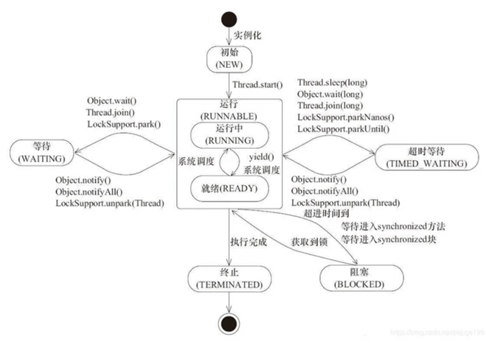
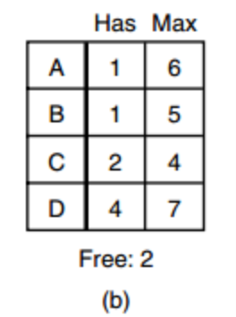
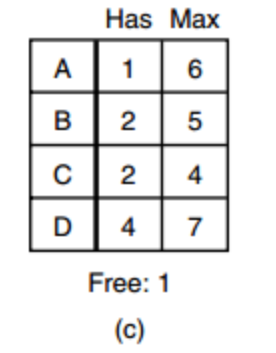
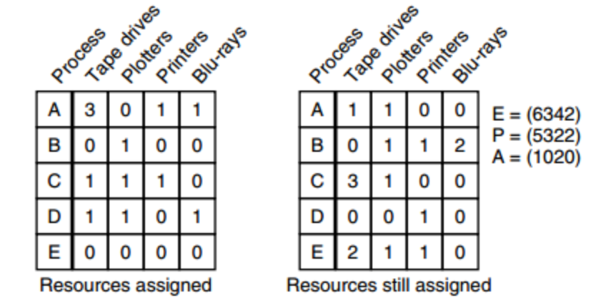

- [操作系统](#操作系统)
  - [1. 进程和线程的区别](#1-进程和线程的区别)
  - [2. 用户级线程（协程）和内核级线程的区别](#2-用户级线程协程和内核级线程的区别)
  - [3. 进程具有哪些状态？](#3-进程具有哪些状态)
  - [4. 进程间通信（IPC）的方式](#4-进程间通信ipc的方式)
  - [5. 线程间同步的方式](#5-线程间同步的方式)
  - [6. 用户空间和内核空间](#6-用户空间和内核空间)
  - [7. 32位的系统会给每个进程分配多大的内存空间？](#7-32位的系统会给每个进程分配多大的内存空间)
  - [8. 有哪些常见的内存管理机制？](#8-有哪些常见的内存管理机制)
  - [9. 什么是快表（TLB）？](#9-什么是快表tlb)
  - [10. 缓冲区溢出是什么？](#10-缓冲区溢出是什么)
  - [11. select() poll() epoll()的区别](#11-select-poll-epoll的区别)
  - [12. 进程的调度算法有哪些？](#12-进程的调度算法有哪些)
  - [13. Linux的硬连接和软连接](#13-linux的硬连接和软连接)
  - [14. 什么是虚拟内存？](#14-什么是虚拟内存)
  - [15. Linux的孤儿进程和僵尸进程](#15-linux的孤儿进程和僵尸进程)
  - [16. 进程创建和切换的过程](#16-进程创建和切换的过程)
  - [17. inode是什么？](#17-inode是什么)
  - [18. 线程的状态有哪些？](#18-线程的状态有哪些)
  - [19. 什么是死锁？如何处理死锁？](#19-什么是死锁如何处理死锁)
  - [20. 什么是银行家算法？](#20-什么是银行家算法)

# 操作系统

## 1. 进程和线程的区别
+ 进程是资源分配的单位，线程是CPU调度的单位。进程的内存区域中有一部分区域是所有线程共享的，以JVM的内存区域为例，堆和方法区就是所有线程共有的。
+ 因为线程的某些资源是共享的，所以一个用户级线程阻塞可能会导致整个进程中的其他线程阻塞。
+ 线程的开销相对进程较小，而进程的创建、销毁、切换都会造成较大的开销。

## 2. 用户级线程（协程）和内核级线程的区别
+ 用户级线程的管理完全由应用程序通过线程库进行，系统内核并不知道这个线程的存在。内核级线程则由操作系统内核进行调度。
+ 用户级线程的切换并不需要进程切换到内核态，因为所有线程管理的数据都存储在用户空间当中。内核级线程的切换则需要进程切换到内核态。
+ 用户级线程可以直接运行在任何操作系统上，而内核级线程不行。
+ 一个用户级线程阻塞会导致整个进程阻塞，内核级则不会出现这种情况。
+ 同一个进程下的多个内核级线程可以用多个处理器内核进行处理，而用户级线程不行。

## 3. 进程具有哪些状态？
进程的状态有五状态模型和七状态模型。  

五状态模型将进程分为：新建、就绪、运行、阻塞、结束。
+ **新建**表示进程正在被创建。
+ **就绪**表示进程已经就绪，只要CPU分配运算资源就可以开始执行。
+ **运行**表示进程正在CPU上运行。
+ **阻塞**状态表示进程正在等待某一事件，比如等待I/O或是等待某个资源被释放，这时CPU不会将运算资源分配给它。
+ **结束**状态表示进程正在结束，可能是因为正常结束或是某些原因中断。

七状态模型则在五状态模型的基础上，增加了**就绪/挂起**和**阻塞/挂起**两种状态。在这两种状态下，进程不在内存中，而是在辅存（一般来说也就是指硬盘）当中。一般来说系统会更倾向于挂起阻塞态的进程。

## 4. 进程间通信（IPC）的方式
进程间通信的方式主要分为管道（分为匿名管道和有名管道）、信号、消息队列、共享内存、信号量和socket七种。
+ **匿名管道**没有名字，是一种半双工的通信方式，也就是说匿名管道只支持单向数据流。此外，由于匿名管道没有名字，因此只能在有亲缘关系的进程之间进行传输，同时，管道传输的数据没有固定格式，需要双方进程提前约定格式。管道以FIFO的规则进行读写，不支持定位操作。
+ **命名管道**则在文件系统中具有文件名，因此能够在本机的任意两个进程之间通信。命名管道与匿名管道一样是半双工、FIFO的。命名管道在写入时需要确定对方是否存在。
+ **信号**是由进程产生并传递给操作系统，操作系统根据信号是否阻塞来决定是否传递给其他进程的。目标进程收到信号后，会根据信号的类型进行处理。常见的Ctrl+C，以及kill()都是信号；在Java使用当中，可以调用
+ **消息队列**是存放在操作系统内核中的信息链表，消息队列可以FIFO地读取，也可以按照消息类型读取，比起管道更加灵活。此外，消息队列也不需要确定对方是否在等待。 Linux提供了msgget()函数用于创建消息队列，msgsend()发送消息，msgrcv()接收消息。
+ **信号量**就是一个整数（也可能是0或1），当有进程或线程获取信号量时，进行P操作，将信号量-1，如果这时信号量为0，就阻塞等待；而当进程或线程释放信号量时，就进行V操作，将信号量+1.
+ **共享内存**是内核留出的一块内存区域，将一块物理内存映射到多个虚拟地址，多个进程都可以读写这一块内存，是最快的IPC方式。
+ **Socket**一般是用来进行网络通信的，而socket所在的是运输层，主要负责在进程之间通信，因此，socket也可以在本机的不同进程之间通信。

## 5. 线程间同步的方式
线程间同步的方式有互斥量、信号量以及事件。
+ **互斥量**本质上就是锁，在访问共享资源之前对互斥量加锁，访问完成之后解锁互斥量。
+ **信号量**则是用来解决互斥量只能管理单个共享资源的问题，信号量本质上是一个整数，当有线程获取共享资源，即进行P操作，将整数-1，此时如果数为0，则线程阻塞等待；而当线程释放共享资源，即进行V操作，将整数+1。
+ **事件**表示通过wait/notify的操作进行线程同步。

## 6. 用户空间和内核空间
Linux按照特权的级别，将内存空间划分成了用户空间和内核空间。我们知道CPU的指令特权等级分为Ring 0 - Ring 3，实际上，R0就是内核态，而R3就是用户态，另外的两个等级在Linux和Windows当中都没有被使用。  

内核空间中存放的主要是操作系统内核的代码和数据，也存储了各个进程的内核栈。而用户空间存储的主要就是进程的代码和数据，并且各个进程的用户空间是独立的。  

当进程运行在内核空间中，我们就称进程处于**内核态**，而进程运行在用户空间时，我们就称进程处于**用户态**。需要进行系统调用的时候，进程就切换至内核态，这个时候进程就会使用内核空间中这个进程的栈，系统会把用户态堆栈的地址存储到内核态的栈里面，然后将堆栈指针指向内核栈。

## 7. 32位的系统会给每个进程分配多大的内存空间？
32位的系统会给每个进程分配4G的虚拟内存空间，这是因为在32位系统当中，每个指针的长度是4字节，表示的范围就是0x00000000 ~ 0xFFFFFFFF，这里表示的恰好是4G的空间。

## 8. 有哪些常见的内存管理机制？
常见的内存管理机制有分页式、分段式、段页式。
+ **分页式**是将内存分为固定大小的页，每个进程被划分到若干个不一定连续的页当中。分页式内存管理可能产生内部碎片，即页的内部可能有一部分空间无法被利用。
+ **分段式**是将内存分为大小不一的段，段中存放一组相对完整的逻辑信息。分段式内存管理则可能产生外部碎片，即段与段之间可能出现无法被利用的空间。
+ **段页式**是将分段式和分页式结合起来的机制，将程序分为多个段，又将每个段分为若干页。

## 9. 什么是快表（TLB）？
快表（TLB）可以理解成页表的缓冲，通常存储在MMU当中，CPU进行寻址时会先到快表当中进行查找，如果没有相应的页表项，才会读取内存，查询页表。
如果没有快表，每次读取内存中的数据都需要读取两次内存，有快表之后，如果快表当中存有页表项，就可以少读取一次内存。

## 10. 缓冲区溢出是什么？
由于系统给程序分配的内存空间是有限的，因此我们如果向缓冲区输入大量信息，就可能会导致堆栈溢出，从而修改其他地方的内存。

## 11. select() poll() epoll()的区别

**（1）	select()**

select()是通过设置和检查fd_set的数据结构来了解fd的状态。它首先将fd_set拷贝到内核空间，之后调用所有fd（文件描述符）的poll()方法，根据返回值给fd_set赋值，如果没有可读写的fd，那么进程就进入休眠，等待被唤醒或超时后再次遍历fd_set。

select()的缺点主要有以下几个方面：
+ 首先，每次调用select都需要将fd_set从用户空间拷贝到内核空间
+ 其次，每次调用select都需要在内核遍历传入的fd_set，时间复杂度为O(N)
+ select能够监视的fd数量有限，32位系统默认是1024个，64位系统默认是2048个

**（2）	poll()**

poll()和select()的机制基本是一致的，区别在于poll()的用链表形式来实现fd_set，这也使得poll()方法监听的文件描述符数量是没有上限的。但是，select的前两个问题也依旧存在。

**（3）	epoll**
epoll使用红黑树和双向链表实现的，epoll通过红黑树来标识fd，而不再使用List，因此查询效率更高；而双向链表则用来实现就绪列表。epoll操作分为epoll_create(), epoll_ctl()和epoll_wait()三个函数。其中：
+ **epoll_create**的作用是创建一个句柄。执行这个函数会在内核的高速cache建立一个红黑树（存储fd）和一个链表（存储就绪列表）。
+ **epoll_ctl**则注册监听的事件类型。每次注册新的事件到句柄当中时，会将所有的fd拷贝进内核。
+ **epoll_wait**则等待I/O事件的产生。

epoll()有两种模式，分别是LT（水平触发）和ET（边缘触发）：
+ **LT**模式下，当epoll_wait()检测到fd有事件发生，应用程序可以选择不进行处理，下次epoll_wait()仍然会通知这个事件。
+ **ET**模式下，当epoll_wait()检测到有事件发生，如果应用程序不进行处理，下次epoll_wait()也不会再通知这个事件。

epoll()对于select()的问题有了较好的解决：
+ 对于select每次调用需要将fd_set拷贝到内核空间的问题，epoll当中的解决方法是，在调用epoll_create()时就在内核的高速缓冲区建立了一个**红黑树**用于存储fd，之后epoll_ctl()时就会将fd存储到红黑树当中，之后调用epoll_wait()就不再需要将fd拷贝到内核空间了。
+ 对于select每次调用需要内核遍历fd_set的问题，epoll的解决方法是，在epoll_ctl()注册事件时，遍历一遍fd，之后为每个fd绑定一个回调函数，当fd就绪之后，直接调用这个回调函数即可将fd放入就绪列表。而epoll_wait()实质上就是在这个就绪列表当中找是否有就绪的fd，因此不再需要每次进行遍历。

## 12. 进程的调度算法有哪些？
进程的调度算法主要有以下几种：
+ **先到先服务**（FCFS）：从就绪队列当中选择最先进入该队列的进程分配资源。（非抢占式）
+ **短进程优先**（SPN）：从就绪队列当中选择运行时间最短的进程分配资源。（非抢占式）
+ **最短剩余时间**（SRT）：会选择剩余时间最短的队列进程执行（抢占式）。
+ **最高响应比优先**（HRRN）：会选择等待时间与执行时间比值最大的进程执行。（非抢占式）
+ **Round-Robin**：每个进程分配一个时间片，轮流执行。（抢占式）
+ **多级反馈队列**：创建多个就绪队列，一个进程就绪时，先放入一级队列，之后如果在一个时间片内没有完成，就放入二级队列，依次类推。而仅当一级队列空闲时，才会去执行二级队列中的进程。（抢占式）
+ **优先权调度**：即优先级高的进程先执行。优先权调度算法又分为抢占式和非抢占式的。

## 13. Linux的硬连接和软连接
Linux的文件链接分为硬连接和软连接。
+ **硬连接**是直接通过索引节点进行的连接，它和源文件有相同的inode号，说明本质上他们是同一个文件。
+ **软连接**又称为符号连接，是一个独立的文件，和源文件的inode号不同，它包含了另一个文件的文件路径（类似于Windows中的快捷方式）。

## 14. 什么是虚拟内存？
+ 虚拟内存使得每个进程认为自己拥有一块独立的、连续的内存，从而使得进程对于内存的操作变得更加容易。
+ 此外，虚拟内存也支持将内存的一部分内容存储到硬盘上，并在需要的时候进行交换。这里就涉及到分页置换算法。

**分页置换**，就是当要获取的页不在主存当中时，需要换掉主存中的页，并将所需的页从外存中读取出来。  

分页置换算法主要有以下几种：
+ **OPT**是最佳分页置换算法，即置换未来最迟被访问的页。但是这种算法是不可能实现的。
+ **LRU** （Linux就使用的是LRU算法）
+ **FIFO**
+ **Clock**算法为每个页维护一个使用位，当需要置换页时，开始指针循环并将使用位置为0，直到遇到使用位为0的页，就将其置换出去。

## 15. Linux的孤儿进程和僵尸进程

+ **孤儿进程**是指进程的父进程已经退出，但父进程的子进程还在运行。孤儿进程会被init进程收集，并用wait()函数回收。
+ **僵尸进程**是指一个进程生成子进程之后，如果子进程退出，而父进程没有调用wait()来回收子进程，子进程的进程控制块就仍然会存储在内存当中。

## 16. 进程创建和切换的过程
**进程创建**的过程如下：
+ 给新进程分配一个唯一进程标识符
+ 给新进程分配空间
+ 初始化PCB
+ 设置正确的连接
+ 创建或扩容其他数据结构

**进程切换**的过程如下：
+ 保存上下文环境，即将寄存器中的值存入内存。
+ 更新当前运行进程的PCB，并将进程的PCB移动到队列中。
+ 选择要切换的进程。
+ 更新内存管理的数据结构，这是因为每个进程被分配的内存空间是独立的。
+ 恢复上下文环境，将内存中这个进程的相关值读取到寄存器中。

## 17. inode是什么？
inode（索引节点）是存储文件元信息的数据结构，它和文件一一对应，Linux使用inode号码来识别文件，而不是使用文件名。

inode存储文件的元数据，其中主要包括：
+ 文件大小（byte）
+ 设备ID
+ 文件拥有者的User ID
+ 文件的Group ID
+ 文件的读写权限
+ 3个时间戳：ctime（inode上次被修改的时间）、mtime（文件上次被修改的时间）、atime（文件上次被访问的时间）
+ 链接数：即有多少个链接指向这个inode
+ 文件数据位置的指针

Linux的inode号码和文件名是分离的，因此修改文件名或位置并不会改变inode号码。同时，一个文件可以有多个文件名（因为每个硬链接的文件名可以不同）。

## 18. 线程的状态有哪些？
以Java为例，Java的线程具有六种状态：
+ New：新创建的线程，尚未调用start()方法执行。
+ Runnable：线程调用start()方法后，进入runnable状态，这时线程正在执行run()方法，可以参加CPU时间片的竞争。
+ Blocked：线程在等待获取monitor锁以进入同步代码块当中。
+ Waiting：线程在等待其他线程做出的操作，比如wait(), join()会使线程进入waiting状态，而notify()可以使线程回到runnable状态。
+ Timed_waiting：不同于waiting，处于timed_waiting状态下的线程可以在一定时间后自行返回。如调用Thread.sleep(), Thread.join(long)可以使Runnable的线程进入timed_waiting状态。
+ Terminated：表示该线程已经执行完毕。

## 19. 什么是死锁？如何处理死锁？
死锁是指两个或两个以上的进程在执行过程中，双方都在等待对方释放资源，而无法继续进行的情况。  

死锁的发生有四个必要条件：**互斥**、**占有和等待**、**不可抢占**、**环路等待**。  

对于死锁是处理方法主要有四种策略：
+ 鸵鸟策略。即忽略死锁的问题。
+ 死锁检测和恢复。这种策略不阻止死锁的发生，而是当死锁发生时检测并对其进行恢复。对单个资源是否发生死锁的检测主要通过判断是否存在环，对于多个资源则通过矩阵进行判断。
+ 死锁预防。主要指破坏死锁的必要条件：比如规定所有进程在开始前获取所需的所有资源，就可以破坏占有和等待的条件。
+ 死锁避免。死锁避免的常见算法是**银行家算法**。

## 20. 什么是银行家算法？
银行家算法是一种死锁避免算法，通过计算给进程分配资源后是否会进入不安全状态来决定是否给进程分配资源。  

安全状态下，系统一定不会发生死锁；如果存在一个由系统中所有进程构成的安全序列P1，…，Pn，则系统处于安全状态。对安全状态的检测与死锁类似，可见下方例子：  

如上图b中，存在空闲资源数为2，当我们将资源分配给C后，C执行完毕，空闲资源将变为4，由此，我们又可以将资源分配给B或D。这样，我们就可以给出一个C→D→B→A的安全序列，因此，b处于安全状态。  

而图c则无法形成一个这样的安全序列，因此我们说c处于不安全状态。  

多个资源的银行家算法也是相似的，我们以下图为例：  

如上图所示，剩余资源向量A=(1,0,2,0)，我们发现D可以执行，执行完成D后，D会释放所有资源，A就变成了(2,1,3,1)，我们又发现E也可以执行。依此类推，我们可以得到D→E→A→B→C的安全序列（此处安全序列不止一个，这里只是举例）。

