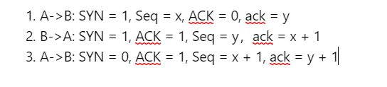
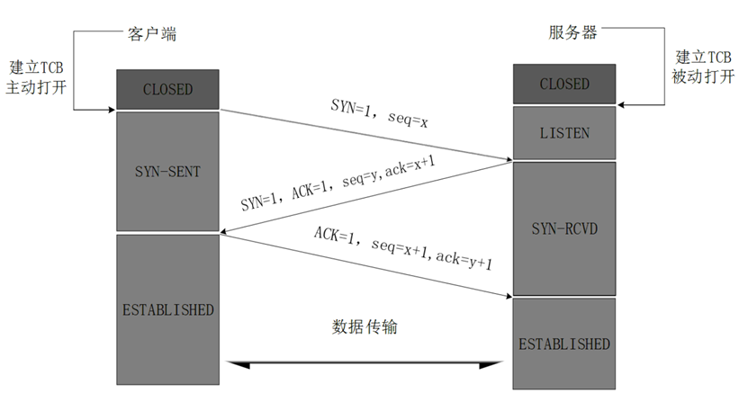
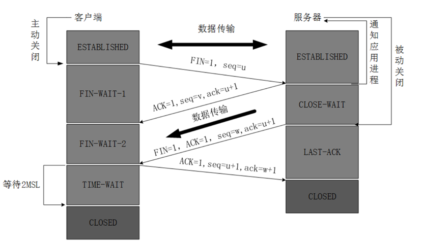
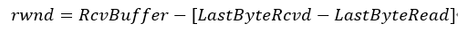
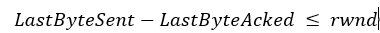
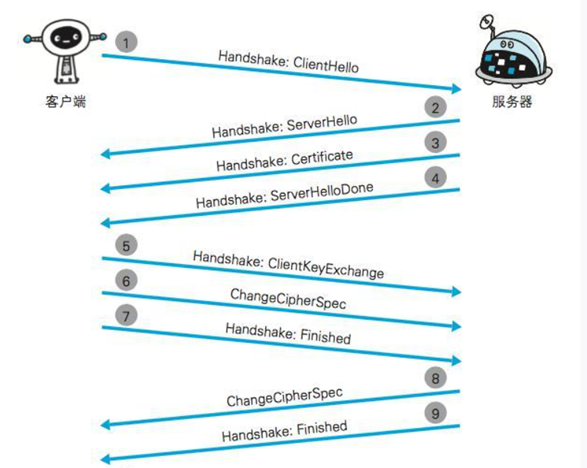
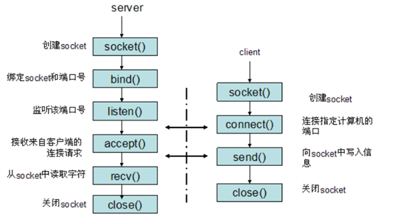
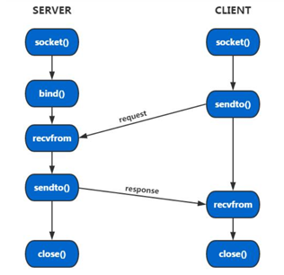

- [计算机网络](#计算机网络)
  - [1. OSI七层模型是如何划分的？](#1-osi七层模型是如何划分的)
  - [2. 从浏览器输入网址到显示出网页发生了什么？](#2-从浏览器输入网址到显示出网页发生了什么)
  - [3. TCP三次握手的过程是什么？为什么要进行三次握手？](#3-tcp三次握手的过程是什么为什么要进行三次握手)
  - [4. TCP四次挥手的过程和原因？](#4-tcp四次挥手的过程和原因)
  - [5. 四次挥手时为什么客户端要等待2MSL（TIME_WAIT/CLOSE_WAIT）](#5-四次挥手时为什么客户端要等待2msltime_waitclose_wait)
  - [6.	TCP和UDP的区别](#6tcp和udp的区别)
  - [7. TCP是如何保证可靠性的？](#7-tcp是如何保证可靠性的)
  - [8. Cookie和Session的区别？](#8-cookie和session的区别)
  - [9. HTTP 1.0 和HTTP 1.1 HTTP 2.0的区别？](#9-http-10-和http-11-http-20的区别)
  - [10. GET和POST的区别](#10-get和post的区别)
  - [11. HTTP和HTTPS的区别](#11-http和https的区别)
  - [12. TCP和UDP对应的socket接口](#12-tcp和udp对应的socket接口)
  - [13. 为什么要通过三个冗余ACK进入快速恢复状态。](#13-为什么要通过三个冗余ack进入快速恢复状态)
  - [14. Ping是用什么协议实现的？](#14-ping是用什么协议实现的)
  - [15. 什么是TCP粘包？如何解决？](#15-什么是tcp粘包如何解决)
  - [16. 交换机和路由器的区别？实现原理？](#16-交换机和路由器的区别实现原理)
  - [17. TCP和UDP的包头保存了哪些内容？](#17-tcp和udp的包头保存了哪些内容)
  - [18. TFO是什么？](#18-tfo是什么)
  - [19. 延迟ACK是什么](#19-延迟ack是什么)
  - [20. IPv4和IPv6的区别？](#20-ipv4和ipv6的区别)
  - [21. TIME_WAIT数量太多怎么办？](#21-time_wait数量太多怎么办)
  - [22. 什么是SYN攻击？](#22-什么是syn攻击)

# 计算机网络

## 1. OSI七层模型是如何划分的？
OSI七层模型在五层模型的基础上，把应用层区分为了应用层、表示层和会话层。其中：
+ **应用层**是网络应用程序和它们的应用层协议存留的地方，比如常用的HTTP，SMTP, FTP, DNS都属于应用层。应用层协议主要是定义应用程序之间交互通信的规则。
+ 表示层的作用是使得交换的应用程序能够解释交换数据的含义。
+ 会话层提供了数据交换的定界和同步功能，包括了建立检查点和恢复方案的方法。
+ **运输层**负责在应用程序端点之间传输应用层报文段（segment）。
+ **网络层**负责将数据报（datagram）从一台主机发送到另一台主机。这期间网络层需要选择合适的网络路线和节点。
+ **链路层**负责将整个链路帧从一个网络元素移动到邻近的网络元素。它先把IP数据报封装成链路层帧，然后在数据链路上进行传输，最后目的地将收到的链路层帧拆封，将其中的数据报上交给网络层。
+ **物理层**则负责将数据的每一个bit移动到下一个网络节点。

## 2. 从浏览器输入网址到显示出网页发生了什么？
首先，输入网址之后，浏览器会从URL当中抽取出主机名，并且将其发送给DNS客户端。  

之后，DNS客户端会向本地DNS服务器发起请求（一般基于UDP），这时如果本地DNS服务器有这个域名的缓存，就会直接将IP地址返回给客户端，否则会迭代地查询根域名服务器、顶级域服务器、权威DNS服务器，这期间也是如果哪一步的结果已经被缓存就直接跳过，最终得到IP地址返回给客户端。  

客户端得到这个IP地址之后，就可以通过这个IP地址来进行HTTP连接。  

HTTP是通过TCP连接实现的，并且HTTP1.1之后，建立的是持续连接，也就是说这里TCP连接建立后会持续一段时间，直到有一段时间无响应之后服务器端才断开TCP连接。  

因此得到IP地址之后，浏览器就与服务器进行三次握手，建立TCP连接，也就是 

 

建立了TCP连接之后，浏览器就会向服务器请求HTML文件以及一些资源文件，之后就通过WebKit来进行页面渲染。

## 3. TCP三次握手的过程是什么？为什么要进行三次握手？

 
（图片来源于网络，侵删） 

其中，SYN表示连接建立，ACK表示确认，seq是发送的包的编号，这里需要随机，主要目的是为了防止第三方预测到序号，从而破坏数据流。交换seq和ack的作用则是为了进行累积确认和选择重传，保证TCP的可靠性。  

选择三次握手主要有两方面的原因：
+ 第一是因为只有通过三次握手，才可以使连接双方都确认连接是正确的。如果只进行两次握手，那么服务端无法确认自己的发送是正确的，也无法确认客户端的接收是正确的。
+ 第二是通过三次握手可以防止失效报文段带来的影响。如果只有两次握手，那么服务端收到失效报文段之后也会返回信息并与客户端进行连接，而如果有三次握手，在服务端收到失效报文段并返回ACK之后，客户端就不会与服务器进行第三次握手来建立连接。

## 4. TCP四次挥手的过程和原因？

 
（图片来源于网络，侵删） 

四次挥手目的是确认双方都不再有待发送的数据。TCP是**全双工**的，也就是说双方都可以发送数据。发送FIN只表示一方没有要发送的数据了，但另一方可能还有要发送的数据。

## 5. 四次挥手时为什么客户端要等待2MSL（TIME_WAIT/CLOSE_WAIT）
防止发出的ACK信息没有被收到，从而导致连接无法被正常关闭。等待2个MSL，如果服务器没有收到ACK报文，就会再给客户端发送一个FIN，客户端就能正常给服务器传回ACK报文。

## 6.	TCP和UDP的区别
+ TCP是**面向连接**的，同时它可以**保证数据的可靠**。
+ 而UDP是**无连接**的，也就是说发送数据之前并不需要建立连接。而UDP是尽最大努力的数据传输，其实也就是**不保证数据的可靠性**。

因为上面的区别，TCP相对更重量级一些，开销相对较大，比较适合对数据可靠性要求较高的传输，比如说文件传输或者发送邮件。而UDP开销就相对较小，并且可以支持广播，就适合一些对于数据可靠性要求不那么高的传输，比如直播、语音通话等等。

## 7. TCP是如何保证可靠性的？
TCP主要通过对包进行编号，以及checksum进行校验来保证数据准确，此外还通过ARQ协议、流量控制和拥塞避免来实现可靠性。  

**（1）	checksum:** 
将TCP包的伪首、TCP报头、数据都分成16位的字（如果是奇数位，就在最后加一个0），将其进行循环加法（溢出部分加到末位），最后将结果取反，就得到了checksum，由发送端进行计算，接收端根据这个checksum进行校验。  

**（2）ARQ：** 
ARQ协议主要分为停止等待和连续两种，停止等待就是每发一个包就停止等待ACK，再发下一个包，这种方法效率很低，就不多提了。 

另外一种就是连续ARQ协议，连续ARQ协议维护了一个发送窗口，其实也就是拥塞窗口（cwnd），只要处于发送窗口中的包都可以发送出去，而接收方会进行累积确认，传回ACK，表示在此之前的所有包都已经收到了，比如传回ACK7，就说明编号为0-7的包都已经收到。每接到一个ACK，发送窗口就移动到这个ACK的编号之后。  

而如果消息没有正确传到接收方，接收方就不会发挥ACK，等到超时之后，发送方就会再次重传发送窗口中的包。  

**（3）流量控制：**  
前面我们说ARQ的时候说到发送方维护了一个发送窗口，那么其实为了进行流量控制，发送方还需要维护一个接收窗口，窗口大小通过返回的报文确定： 

 

并且需要保证: 
 

而当rwnd = 0时，接收方仍然会给发送方持续发送大小为1字节的报文段。  

**（4）拥塞控制：**  
说到拥塞控制就又回到一开始说连续ARQ的时候提到的发送窗口，这个发送窗口也叫做拥塞窗口，拥塞控制算法主要分为三个阶段，分别是慢启动、拥塞避免以及快速恢复。  

在**慢启动**阶段下，每过一个阶段cwnd的大小就翻倍。
+ 当cwnd的值达到阈值之后，就进入拥塞避免阶段；
+ 而如果出现超时错误，就会将阈值设为cwnd/2，再将cwnd设为1 MSS，重新进入慢启动状态。
+ 如果检测到三个冗余ACK，就会进入快速恢复阶段。将阈值设为cwnd/2，并且把cwnd设为ssthres+3*MSS

在**拥塞避免**阶段，每个RTT，cwnd的值会增加一个MSS。当出现超时时，处理方法与慢启动阶段时相同，也是ssthresh = cwnd / 2, cwnd = 1 MSS，同样，如果出现三个冗余ACK，则进入快速恢复阶段。  

在**快速恢复**阶段下，每出现一个冗余的ACK，cwnd的值就加上一个MSS，出现超时丢包时，也进入慢启动状态，而当一个新的ACK到达之后，就进入拥塞避免阶段。

## 8. Cookie和Session的区别？
HTTP是无状态的，而Cookie和Session都是为了解决这个问题产生的。
Cookie存储在客户端，而Session则存储在服务端，相对来说Session的安全性会更高一些，但Session也会给服务器带来更大的负担。

## 9. HTTP 1.0 和HTTP 1.1 HTTP 2.0的区别？
**1.0 -> 1.1：**
+ 首先，HTTP1.0和HTTP1.1最主要的区别是HTTP1.0是非持续连接，而1.1默认是**持续连接**。持续连接意思是在HTTP1.1之后，客户端与服务器建立连接，传输对象之后不会立即关闭连接，接下来如果要继续传输对象就不需要再进行三次挥手。
+ 同时，HTTP1.1也支持了流水线传输（也叫做**管线化**），也就是说浏览器可以一次性将多个请求发送给服务器，让服务器进行处理，而不需要再等待一个请求得到响应后再去进行下一个请求。
+ 另外一个比较主要的更新就是增加了range头，从而支持范围请求，也就是我们可以只请求一个资源的一部分，在这之后我们下载文件就可以进行断点续传了。而服务端也可以将Accept-Range设为none来标识不支持range，这种情况下浏览器一般会禁用下载的暂停键。
+ 此外，还有一些更新，比如添加了一些状态码，如409（冲突），410（Gone，表示资源已被永久删除），还有新添加了一些请求头，比如If-Unmodified-Since（如果在这之后被修改就返回412）.

**1.1 -> 2.0**
+ 增加了**多路复用**的支持。所有对同一域名的请求将通过一个TCP连接来完成，一个TCP连接可以承载任意数量的双向数据流。多路复用和管线化的区别在于：
  - 管线化必须按序响应，如果前一个请求阻塞了，后面的响应也无法进行；
  - 而多路复用则是对二进制帧的传输，可以使得不同请求的帧混杂在一起进行传输，之后再拼装在一起。
+ 同时，HTTP2.0还可以给数据流设置优先级，优先级高的数据流会被服务器优先响应。
+ HTTP2.0还压缩了header，1.1以及之前，HTTP的请求头都是以文本传输，而2.0开始改为用二进制进行传输，同时传输双方各自缓存一张header field表，这样使得header的大小变小，并且避免了header的重复传输。

## 10. GET和POST的区别
+ GET产生一个数据包，POST产生两个。GET会直接将请求头和数据一起发送，而POST会先发送请求头，得到100响应之后再继续发送数据。
+ 一般来说，GET是通过**参数**传输数据，而POST是通过**body**传输数据。但是这种情况并不绝对，我记得我在网络上看到过说GET和POST本质上其实是一样的，实际上GET也一样可以通过body传数据，比如用postman或者curl就可以在GET请求的body中附带数据。不过一般情况下，GET都是通过参数来传递数据的，比如ajax就不支持在GET请求的body添加数据。
+ GET请求会被浏览器主动缓存，而POST不会。要防止缓存可以考虑在网址之后加一个key或者时间戳。
+ GET在回退的时候是没有影响的，但是POST回退会再次发送请求。
+ GET请求应该是**幂等**的，也就是说对同一URL进行多次请求的返回内容应该一致。

## 11. HTTP和HTTPS的区别
实际上，我们可以认为HTTPS就是HTTP+SSL/TLS，在HTTP协议下，HTTP直接运行在应用层上，与TCP连接，而在HTTPS中，HTTP和TCP之间多了一层SSL/TLS，它们代替了HTTP的部分通信接口。  
在连接过程上，HTTP是三次握手（TCP），而HTTPS是四次握手。  

单纯的HTTP有一些不足，可能导致信息传输的不安全：
+ 明文通信
+ 不验证通信方的身份
+ 不验证报文的完整性

处理的方法就是HTTPS，HTTPS为HTTP提供了加密、认证以及完整性保护。  

**加密**的方法一般分为对称式和非对称式两种：
+ **对称加密**：双方都使用同一个密钥。这种方法的优点在于加密和解密速度快，但缺点在于必须双方提前商定密钥，或者随着请求将密钥一起发送，两种情况密钥都有泄露的风险。
+ **非对称加密**：密钥由私钥和公钥组成，私钥仅由一方保管，而公钥可以发送给所有要请求它的人。相比起对称加密，非对称加密更加安全，但相对来说加密和解密也更慢。

HTTPS使用的则是混合式加密，在交换密钥的过程中使用非对称加密，成功交换密钥之后，则使用对称式加密，来提高效率。  

**认证**则主要通过CA证书来完成，收到CA证书的客户端可以根据认证机构发出的公开密钥对证书上的数字签名进行验证。  

**完整性保护**在TLS中主要通过**摘要算法**来实现。

HTTPS的四次握手大致过程如下：
+ 首先客户端先发起第一次握手，向服务器发起请求。
+ 之后服务器返回Certificate报文，其中包含公钥证书。（第二次握手）
+ 客户端发起第三次握手，发送Client Key Exchange报文，将用公钥加密后的共享密钥发送给服务器。
+ 服务器发起第四次握手，发送Change Cipher Spec报文。

 
（图片好像出自《图解HTTP》，侵删）

## 12. TCP和UDP对应的socket接口
**TCP**： 
 
（图片来源于网络，侵删） 

三次握手：connect() 和 accept()
+ 服务端在客户端向其发送第一次握手之前，已经用socket()创建socket，用bind()绑定socket和端口号，再用listen()监听端口号。
+ 之后，客户端用socket()创建socket，并用connect()发起第一次握手（connect()是阻塞函数），触发三次握手。
+ 服务端用accept()同意连接，进行第二次握手。（accept()是阻塞函数）同时，向客户端返回connect()的结果。
+ 客户端向服务器发送SYN=0，ACK=1的包，返回accept()的结果。

四次挥手：close()

**UDP**:
UDP用到的socket API主要有socket() bind() sendto() recvfrom() close() 

## 13. 为什么要通过三个冗余ACK进入快速恢复状态。
因为丢包一定会造成三个冗余ACK（当然，乱序也可能造成三个冗余ACK）。
假设后方还有超过3个包，丢包造成三个冗余ACK的概率为100%，而乱序导致的概率为40%（穷举顺序）

## 14. Ping是用什么协议实现的？
Ping命令是通过ICMP协议实现的，ICMP协议是网络层协议。由于IP协议不保证可靠连接，因此对于ping操作需要ICMP协议来实现，客户端向服务器发送一个类型为8的ICMP报文，如果没有异常，服务器会返回一个类型为0的响应报文。如果发生异常，比如超时（TTL减为0）、不可达，路由器就会发回对应的ICMP报文。

## 15. 什么是TCP粘包？如何解决？
TCP粘包就是指发送的若干TCP包在接收方接收到时粘成了一个包。这是因为TCP是面向流的协议，而不是基于包的协议，因此TCP只保证字节流的顺序。  

因此，解决粘包需要在应用层实现，解决方式主要有：
+ 固定消息的长度，便于接收端进行分包
+ 将包的长度和包一起发送
+ 使用特殊标记来进行间隔

## 16. 交换机和路由器的区别？实现原理？
+ 交换机工作在链路层，根据MAC地址寻址；路由器工作在网络层，根据IP地址寻址。
+ 交换机主要负责网络内部的数据转发，路由器负责不同网络的数据转发。

路由器内部维护了一个路由表，记录目的网络和对应的下一跳路由器。如果表中存有目的网络的信息，则将信息转发到对应的下一跳路由器；否则，转发到默认的下一跳路由器。

## 17. TCP和UDP的包头保存了哪些内容？
TCP的包头存储的以下内容：
+ 源端口号和目标端口号（各16位）
+ seq（顺序号） 32位
+ ack（确认号） 32位
+ 标志位，如SYN ACK FIN URG等 (6位)
+ 接收窗口大小 16位
+ Checksum
+ 紧急指针：如果URG为1，该指针用于标识紧急数据结束的位置

UDP包头存储了以下内容：
+ 源端口号和目标端口号（各16位）
+ 长度（16位）
+ Checksum（16位，可选）

## 18. TFO是什么？
TFO（TCP Fast Open）是使得TCP在三次握手期间也可以传输数据的新技术。尽管现在TCP支持长连接，但是仍然有很多情况下会发起一次新的连接请求，这样就需要重新进行三次握手，从而消耗一个RTT的时间（这里说是一个RTT是因为第三次握手已经可以携带数据）。  

TFO的大致过程如下：
+ 客户端发送SYN包，在包尾附上一个4 bytes的FOC请求。
+ 服务器会生成一个8 bytes的cookie，将这个cookie加在SYN+ACK报文的末尾发送回去
+ 此时，客户端会缓存这个cookie，留待下一次请求时使用。
+ 下一次发起连接请求时，客户端发送SYN包，后面附上先前的cookie，此时可以直接附上数据。
+ 服务端收到之后，会对cookie进行校验，并发回SYN+ACK包，此后不再等待客户端传来的ACK确认，而是直接开始传输相应数据。

TFO虽然可以节省三次握手带来的时间损耗，但是存在一些安全问题（如伪造TFO SYN攻击）因此还没有大范围使用。

## 19. 延迟ACK是什么
延迟ACK是一种可以将多个ACK一并发送的机制。  

判断是否发送延迟ACK的过程主要如下：
+ 如果收到的包大于1MSS，直接发送ACK
+ 如果收到的包是乱序的，直接发送ACK
+ 如果收到的接收窗口以外的数据，直接发送ACK
+ 如果处于quick mode，直接发送ACK
+ 否则，延迟ACK

## 20. IPv4和IPv6的区别？
+ IPv4的地址为32位，IPv6的地址为128位，这使得IPv6的地址在未来也很难被消耗完。
+ IPv6使得用户可以对网络层数据进行加密和校验，提高了安全性。
+ IPv6增强了对移动设备的支持，使其切换链路时也不会丢失连接。

## 21. TIME_WAIT数量太多怎么办？
如果在高并发的短连接下，就会出现很多TIME_WAIT，从而消耗大量的系统资源。可以通过修改tcp_tw_reuse或tcp_tw_recycle参数来缓解这种情况。

## 22. 什么是SYN攻击？
SYN攻击是利用TCP三次握手的特性，大量地使用伪造的IP地址向服务器发送SYN请求，之后服务器会返回ACK并留下端口等待最终进行连接。而实际上攻击方并不会回应ACK，使得服务器保持在半开连接的状态，积压服务器负载，最终导致服务器无法正常提供服务。