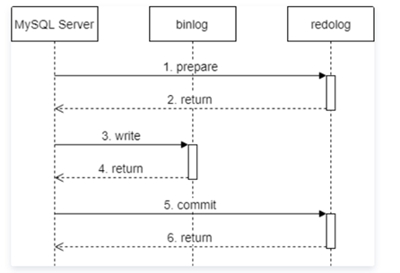

- [MySQL](#mysql)
  - [1. 数据库事务的四大特性？](#1-数据库事务的四大特性)
  - [2. 数据库的隔离级别？](#2-数据库的隔离级别)
  - [3. 并发事务会带来哪些问题？](#3-并发事务会带来哪些问题)
  - [4. 快照读和当前读的区别](#4-快照读和当前读的区别)
  - [5.	谈一谈大表优化的方式](#5谈一谈大表优化的方式)
  - [6. MySQL如何保证一致性？](#6-mysql如何保证一致性)
  - [8. MySQL索引的原理？为什么要用B+树？](#8-mysql索引的原理为什么要用b树)
  - [9. 使用索引需要注意什么？](#9-使用索引需要注意什么)
  - [10. ORDER BY的原理](#10-order-by的原理)
  - [11. 慢查询优化的步骤](#11-慢查询优化的步骤)
  - [12. MySQL常见的引擎？应用场景分别是什么？](#12-mysql常见的引擎应用场景分别是什么)
  - [13. 聚簇索引和非聚簇索引](#13-聚簇索引和非聚簇索引)
  - [14. 主从复制的原理](#14-主从复制的原理)
  - [15. MySQL bin log的格式](#15-mysql-bin-log的格式)
  - [16. 数据库的三大范式](#16-数据库的三大范式)

# MySQL

## 1. 数据库事务的四大特性？
数据库事务的四大特性是ACID，其中：
+ A表示**原子性**（Atomic），指的是每个事务都被视为不可分割的最小工作单元，意思就是一个事务要么完全执行，要么不执行。事务的原子性是通过**undo log**实现的。
+ C表示**一致性**（Consistency），指的是每个事务提交后，数据库都会从一个有效的状态转移到另一个有效的状态，这里的有效其实就是正确的意思。关于一致性的实现可见[6](#6-mysql如何保证一致性)
+ I表示**隔离性**（Isolation），指的是一个事务在提交之前进行的修改对于其他事务是不可见的。RC隔离级别下，数据库通过写入操作时加锁来实现隔离性；RR隔离级别下，InnoDB通过**MVCC**机制实现隔离性。
+ D表示**持久性**（Duration），指的是事务提交之后其所做的修改就会永久性地保存在数据库中。比如说我们提交之后出现了断电、宕机等情况，数据库在重启之后也可以通过**Redo Log**来重新执行我们之前提交的事务。

## 2. 数据库的隔离级别？
SQL定义了四种隔离级别，分别是RU, RC, RR, SERIALIZABLE，其中：
+ **RU**表示未提交读，意思是其他的事务可以读取还没有提交的数据修改。RU是最低的隔离级别，会导致“脏读”的情况。
+ **RC**表示提交读，意思是提交之前的修改对其他事务是不可见的，事务只能读取到其他并发事务提交之后的数据。RC的隔离级别虽然解决了“脏读”的问题，但是仍会遇到不可重复读以及幻读（Phantom Read）的问题。
+ **RR**表示可重复读，这一隔离级别解决了不可重复读的问题，保证了一个事务对同一个记录的多次读取结果是一致的。RR是InnoDB的默认隔离级别，在RR的标准下，仍然可能出现幻读的情况，但是InnoDB实现了MVCC以及Next-key lock两种机制来防止幻读。
+ **SERIALIZABLE**表示可串行化，它是最高的隔离级别，可以确保数据的一致性，但是这种隔离级别下就没有并发了。

## 3. 并发事务会带来哪些问题？
并发事务所带来的问题主要有三个，脏读、不可重复读以及幻读。
+ 其中，**脏读**指的是事务读取了未提交的数据，而这种“脏数据”很可能是不正确的。
+ **不可重复读**指的是一个事务两次读取同一个记录，得到的数据不一致的情况。产生这种情况是因为RC隔离级别下读取数据时不会禁止其他事务写入该数据。
+ **幻读**是指一个事务在读取某个范围内的记录时，另一个事务又在这个范围中插入了数据，因此第一个事务第二次读取这个范围的记录时，会读取到新的数据。幻读与不可重复读的区别在于幻读是两次读取得到的行数不同，而不可重复读是两次读取的同一记录的值不同。

## 4. 快照读和当前读的区别
+ **快照读**读取的是数据记录的可见版本，比如InnoDB实现的**MVCC**机制，事务通过快照读读取数据的时候，只会读取到DB_TRX_ID（事务ID）小于当前事务ID，且DB_ROLL_PT（删除ID）为Null或大于当前事务ID的数据。一般来说，SELECT就是快照读。
+ **当前读**读取的是数据记录的最新版本。一般来说select for update, update, insert, delete使用的就是当前读。

## 5.	谈一谈大表优化的方式
数据量较大的时候，我们可以进行分库分表、读写分离，同时也可以对查询进行一些优化。
+ 首先需要考虑的是分库分表，因为数据量太大的时候数据库本身的性能会受到很大的影响。而分库分表主要有垂直和水平两种。
  1. 垂直分区是数据表的列进行拆分。我们可以把数据库中一些列数较多的表拆分，并放到不同的数据库服务器当中。
  2. 水平分区则是把数据表的行进行拆分，我们可以把数据库的行按照范围或者是hash算法来分成不同的表，并且放到不同的数据库服务器当中去。
+ 其次需要考虑的是读/写分离，可以将数据库分为多个，主库负责写，从库负责读。

## 6. MySQL如何保证一致性？
数据库的一致性主要可以从几个方面考虑，分别是bin log和redo log的一致性，数据文件的一致性，还有主从库的一致性。  

**(1) bin log和redo log的一致性**  

MySQL的bin log和redo log的一致性是通过基于内部XA的二阶段提交（2PC）实现的，也就是说，在事务提交之后，会先在redo log中prepare，之后再在bin log中写入，最后在redo log中commit。  

  

**(2) 数据文件的一致性**  

InnoDB数据文件的一致性是通过**双写缓冲**（double write buffer）来实现的，双写缓冲主要解决了**部分页面写入**（partial page write）问题，部分页面写入问题是指：由于InnoDB的最小读取单位是16KB的页，而磁盘IO一般是由扇区进行，每个扇区大小是512B，如果在一页写入一半时，出现了断电等情况，就会导致这一页受损，同时，由于页受损，页头信息也无法正确读取，从而无法用redo log恢复。  

双写缓冲就是指，InnoDB在写入数据时会写入两次，第一次先写入磁盘上的双写缓冲当中，第二次在写入数据文件中。这样，当出现断电的情况时，如果正在写入缓冲，就不需要进行处理，而如果出现脏页，就在重新通电后再次写入。  

**(3) 主从库的一致性**  

可以使用AFTER_SYNC的半同步复制，执行流程大致如下：
+ 主库先写入bin log
+ 然后通知从库写入relay log（中继日志）
+ 等待N个从库返回写入完成后，主库提交事务
+ 返回结果

这样子，在主库宕机之后，可以迅速进行主从切换，而不会丢失数据。

## 8. MySQL索引的原理？为什么要用B+树？
MySQL的索引是通过B+树实现的。在B+树结构当中，只有叶节点真正存放了数据（聚簇索引）或者是指向数据的指针（辅助索引），而其他节点都只是存放了指引搜索方向的数据项。  

使用B+树而不使用B树的原因是，B树的数据存在各个节点，不利于遍历数据或者进行范围查询。而MySQL的B+树结构，无论是否是聚簇索引，叶节点都存储了一个指向下一个叶节点的指针，便于进行遍历和范围查询。  

使用B+树而不使用AVL/红黑树的原因是，B+树的分支更多，因此B+树的高度比其二叉树也会更小，高度越小，IO次数就越少，查询效率也就更高。   

使用B+树而不使用哈希表的原因是，使用哈希表进行哈希处理之后，就无法通过索引进行范围查询和排序操作，而只能通过全表查询进行；同时，当数据量较大时，哈希表的查询效率也会降低。 

## 9. 使用索引需要注意什么？
+ 需要注意**最左前缀匹配原则**。MySQL会一直向右匹配，直到遇到范围查询就停止匹配。因此，尽量将范围查询的列放在索引的最后。
+ 索引列不能参与计算。比如，不能用from_unixtime(create_time) = ’2014-05-29’，而要改成create_time = unix_timestamp(’2014-05-29’)。
+ 尽量选择区分度高的列作为索引。区分度的计算公式是count(distinct *) / count(*)。比如性别列就只有男/女，区分度就很低，在大数据场景下区分度趋近于0；而唯一列区分度就高，为1.
+ 查询时=和in可以乱序，因为MySQL的查询优化器可以优化成索引能识别的形式。

## 10. ORDER BY的原理
首先，ORDER BY会尝试使用索引来直接给出结果，因为数据在索引的叶节点当中本身就是有序的。  

而如果没有可用的索引，就需要使用排序算法来实现。  

如果数据量较小，可以全部放入内存，就使用快速排序；而如果数据量较大，无法一次全部放入内存，就会使用归并排序。  

同时，排序的方法也分为单次传输和两次传输：
+ **单次传输**是指一次性把查询需要的所有列读取出来，然后再根据条件列进行排序。这样的优点是不需要进行随机I/O，但坏处是会占用较多的内存空间。
+ **两次传输**就是指先只读取行指针和需要排序的字段，进行排序之后，再读取所需的其他列。这样的好处在于可以节省内存空间，使得内存中可以容纳更多行；但是坏处在于会产生大量的随机I/O。

## 11. 慢查询优化的步骤
首先，用explain查看执行计划：
+ 首先从rows看行数，如果过高说明可能有可以优化的地方，因为绝大多数rows低的表查询都是比较快的，当然也有例外
+ 从table看是否有不必要的临时表
+ 从key看是否成功用上了索引，Extra中看Using Index判断是否用上了覆盖索引。

其次，可以选择对单表的字段分别查询，看哪个列的区分度高。  

此外，也可以尝试去了解业务场景，因为有时候有的列看似区分度不高，但是由于业务关系，符合条件的查询结果当中数据是不平衡的（比方说我们要查某一段时间，这段时间内几乎都是1），这种情况下我们也可以将其设为索引。  

可以阅读美团技术团队的博客[MySQL索引原理及慢查询优化](https://tech.meituan.com/2014/06/30/mysql-index.html)

## 12. MySQL常见的引擎？应用场景分别是什么？
MySQL最常用的有**MyISAM**引擎和**InnoDB**引擎，此外比较特别的还有Memory引擎。  

MyISAM和InnoDB都是使用B+树作为索引的，它们之间的区别主要是：
+ MyISAM不支持事务，InnoDB支持事务
+ MyISAM不支持行级锁，InnoDB支持行级锁和表级锁
+ MyISAM不支持外键，InnoDB支持外键
+ InnoDB实现了MVCC机制，解决了快照读情况下的幻读问题
+ InnoDB支持聚簇索引，MyISAM使用的是非聚簇索引

大多数情况下，我们现在都是使用**InnoDB**，因为它支持事务、行级锁，同时有undo log用于回滚，redo log和2PC的机制可以进行数据恢复，此外，由于支持聚簇索引，它在特定情况下的性能也会优于MyISAM。  

而在读较多且可以容忍一定程度的数据丢失的情况下，我们也可以考虑使用MyISAM。比如在做读写分离的时候，负责读的从库就可以选择用MyISAM。  

此外，还有一种**Memory**引擎，Memory引擎和我们之前提到的MyISAM和InnoDB都有较大的不同。首先，最大的区别在于MyISAM和InnoDB等主要的MySQL引擎都将数据存储在磁盘当中，而Memory引擎则将数据直接存储在**内存**中，这也是它得名的原因。这样可以提高查询的速度，但是一旦数据库服务器重启，这块数据就会丢失；而且，Memory引擎并不支持数据的持久化，因此我们目前更倾向于使用具有持久化功能的Redis。此外，Memory引擎使用的是**哈希索引**，而不是MyISAM和InnoDB所使用的B+树。

## 13. 聚簇索引和非聚簇索引
+ InnoDB使用的是聚簇索引，聚簇索引下，一般主键作为聚簇索引叶节点存放了数据行以及指向下一个叶节点的指针，而辅助索引的叶节点则存储了主键的值以及指向下一个叶节点的指针。
+ MyISAM使用的是非聚簇索引，此时不论是否是主键的索引，叶节点都存储的是指向数据行的指针以及指向下一个叶节点的指针。

聚簇索引的优点主要在于：
+ 可以把相关数据存储在一起
+ 因为数据行直接存储在B+树中，所以访问数据比非聚簇索引更快
+ 覆盖索引扫描时可以直接使用叶节点当中的主键值

但是聚簇索引也有一些缺点，比如：
+ 插入新行可能导致**页分裂**，就是说一个页满了的情况下，如果需要在这个页的数据范围内插入数据，就需要将页分为两个。
+ 更新聚簇索引的代价很高，因为需要移动每一个数据行。

## 14. 主从复制的原理
MySQL的主从复制主要通过三个线程来实现：
+ bin log线程负责将主库中更新数据的语句写入到bin log当中
+ I/O线程负责读取主库的bin log并且将其写入到从库的relay log当中
+ SQL线程负责读取relay log，并按照relay log的操作更新从库

而MySQL的主从复制还分为三种模式：异步、半同步和同步。
+ **异步复制**时，主库在写入完成之后会直接向客户端返回，而不管从库是否正确更新数据。
+ **半同步复制**时，主库在写入之后需要等待至少一个从库写入完成之后，才向客户端返回。半同步复制又分为AFTER_COMMIT和AFTER_SYNC两种，区别在于：
  - AFTER_COMMIT模式是在主库完成commit之后才发送bin log给从库；
  - AFTER_SYNC模式是等待N个从库写入完成之后才commit，后者更能确保主从库的一致性。
+ **同步复制**时，主库在写入之后，必须等待所有从库都成功写入，才会向客户端返回值。

## 15. MySQL bin log的格式
Bin log的格式有Statement, Row和Mixed三种：
+ Statement格式是直接记录SQL语句在bin log当中，优点是log的大小相对较小，缺点是部分函数可能无法正确复制，从而可能会导致主从的不一致。
+ Row格式是将SQL语句分解为基于行更改的语句。优点是不会出现语句运行结果不一致的问题，缺点是会产生大量的log。
+ Mixed则是两种模式的混合，将Statement可以正确复制的部分用Statement来存储到bin log，而Statement无法正确复制的部分，则使用Row。

## 16. 数据库的三大范式
+ **第一范式**：表中的每个列都具有原子性，不可分割。
+ **第二范式**：表中的每个列都和主键相关。
+ **第三范式**：表中的每个列都和主键直接相关，即不存在传递依赖。

当我们实现了第三范式之后，数据库基本可以认为是没有冗余的，但是没有冗余的数据库并不一样符合我们的业务需求，有时为了查询效率，在保证数据一致性的情况下可以有一定的数据冗余，从而减少表关联，并使得索引设置更加简单，我们称之为**反范式**。
