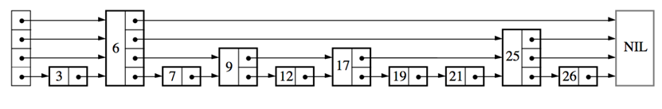

- [Redis](#redis)
  - [1. 介绍Redis的五种数据类型](#1-介绍redis的五种数据类型)
  - [2. Redis为什么使用单线程？](#2-redis为什么使用单线程)
  - [3. Zset跳表（skip list）的数据结构](#3-zset跳表skip-list的数据结构)
  - [4. 为什么zset用跳表而不用红黑树？](#4-为什么zset用跳表而不用红黑树)
  - [5. Redis的数据过期和淘汰策略](#5-redis的数据过期和淘汰策略)
  - [6. Redis持久化机制](#6-redis持久化机制)
  - [7. 什么是缓存穿透？怎么解决？](#7-什么是缓存穿透怎么解决)
  - [8. 什么是缓存雪崩？怎么解决？](#8-什么是缓存雪崩怎么解决)
  - [9. 缓存穿透和缓存击穿的区别？](#9-缓存穿透和缓存击穿的区别)
  - [10. Redis为什么快？](#10-redis为什么快)
  - [11. Redis集群是如何寻址的？](#11-redis集群是如何寻址的)
  - [12. Redis哨兵机制是什么？](#12-redis哨兵机制是什么)
  - [13. Redis主从复制的机制](#13-redis主从复制的机制)
  - [14. Redis字典的底层数据结构](#14-redis字典的底层数据结构)

# Redis

## 1. 介绍Redis的五种数据类型
Redis的五个基本数据类型有string, list, hash, set, zset。
+ string：string是key-value的数据类型，同时Redis的字符串是可修改的。
+ list: list是链表，Redis的list实现为双向链表。
+ hash: hash实际上就类似于Java的HashMap，适合用于存储对象。
+ set: set是一种无序集合，存储的数据无序且不重复。提供了检测集合中是否存在该数据的接口。
+ zset: zset是有序集合，存储的数据是有序的。它添加了一个权重参数score，可以通过权重进行排序。

## 2. Redis为什么使用单线程？
+ Redis是基于内存的操作，因此性能瓶颈一般不在于CPU的利用率，而在于内存或是网络带宽。
+ Redis通过I/O多路复用的机制，使得对于连接的监听不需要多个线程。
+ 多线程可能造成线程死锁，同时线程切换带来的开销也较大；因此在单线程可以保证效率的情况下，就可以不引入多线程。

## 3. Zset跳表（skip list）的数据结构
跳表主要包含以下的部分：
+ 表头：主要负责维护跳表的指针节点
+ 节点：每个节点当中存储了对象、score、若干个层
+ 层：保存着连接到其他元素的前进指针
每当插入一个节点，会随机设置该节点的层数。之后从高层向底层逐渐尝试查找合适的位置。

 

## 4. 为什么zset用跳表而不用红黑树？
+ 因为zset并没有比红黑树多消耗很多内存
+ 跳表更适合进行范围查询
+ zset比红黑树更加容易实现

## 5. Redis的数据过期和淘汰策略
Redis的数据**过期策略**主要有三种：
+ **定时过期**：为每个设置过期时间的key绑定一个定时器，到达过期时间就立刻删除。
+ **惰性过期**：仅当访问缓存时判断缓存是否过期。
+ **定期过期**：每隔一段时间，扫描部分的key，并判断是否过期。

Redis的数据淘汰策略主要有以下六种：
+ **Volatile-LRU**: 从已设置过期时间的数据中挑选LRU的数据淘汰
+ **Volatile-TTL**: 从已设置过期时间的数据中挑选将要过期的数据淘汰
+ **Volatile-random**: 从已设置过期时间的数据中随机淘汰
+ **Allkeys-LRU**:当内存不足时，移除LRU的key
+ **Allkeys-random**: 当内存空间不足时，随即移除数据
+ **No-eviction**：禁止驱逐数据。

## 6. Redis持久化机制
Redis持久化，即将Redis内存中存储的数据放到硬盘当中，这样即使重启或是断电数据也不会丢失。  

Redis的持久化主要有两种机制：
+ **RDB**（快照持久化）是指创建快照来存储内存在某个时间点保存的数据。是Redis默认的持久化机制。
+ **AOF**（只追加文件）持久化是指将Redis执行的进行数据修改的命令存储到文件当中。而AOF持久化又分为always, everysec和no三种方法：always表示每次修改都持久化到磁盘；everysec表示每秒同步一次，no则表示让操作系统来决定何时进行同步。

此外，Redis 4.0开始支持混合式，AOF重写时会把RDB写到AOF文件的开头。

## 7. 什么是缓存穿透？怎么解决？
缓存穿透就是指出现大量**不存在**的key请求，导致大量的请求直接打到数据库上。  

解决缓存穿透的方法主要是**布隆过滤器**。  

布隆过滤器是由一个位数组和一系列哈希函数组成的，当我们加入一个元素之后，布隆过滤器会通过这些哈希函数来计算元素值，并得到一个哈希值，之后将bitmap的对应位置设为1。  

而如果我们需要判断一个元素是否存在时，会对给定的元素进行相同的哈希计算，之后检查对应位置是否都为1。  

根据上面这个机制，我们可以发现，如果这个元素存在于布隆过滤器当中，那么一定会判定为存在，但是判定为存在的不一定实际存在。

## 8. 什么是缓存雪崩？怎么解决？
缓存雪崩是指缓存在某一时间大规模失效，从而导致大量的请求落到数据库，导致数据库短时间内承受大量请求，从而可能导致宕机。  

解决方法主要有：
+ 设置不同的缓存过期时间，避免同一时间段内大量缓存同时失效。
+ 采用Redis集群，防止Redis失效

## 9. 缓存穿透和缓存击穿的区别？
+ **缓存穿透**是指大量**无效**key（即缓存和数据库中都没有）的访问导致大量请求被提交到数据库。
+ **缓存击穿**是指大量数据库中有而缓存中没有的数据请求导致大量的数据库请求。

## 10. Redis为什么快？
+ 首先，最主要的原因是Redis运行在内存当中，每次读取缓存中的数据不需要从磁盘I/O，因此速度会比要从磁盘中读取数据的数据库要快很多。
+ 其次，Redis支持I/O多路复用实现非阻塞I/O，可以用一个线程监听多个连接，这样就避免了线程切换带来的开销。
+ 此外，Redis还实现了多种高效的数据结构，比如skip list、字典、zip list。

## 11. Redis集群是如何寻址的？
Redis集群采用**一致性哈希算法**来进行寻址。如果使用普通的哈希算法，然后根据集群中的节点数来判断key位于集群中的哪个主节点上，一旦某个节点无法正常工作，或是需要添加一个新的节点，导致节点数变更，就会导致哈希算法无法寻找到key，从而使得大量请求打到数据库上。  

为了解决这个问题，我们需要引入**一致性哈希算法**，也就是说，我们不再对节点数取模，而是对231取模，形成一个环。之后，我们根据节点的哈希值判断节点位于哪个位置。当传来一个key之后，首先对key计算哈希值，然后在环上顺时针移动，从找到的第一个节点请求key。  

使用一致性哈希算法之后，即使节点数发生了变化，影响的范围也仅仅在一个节点，而不会使得大量的节点同时失效，从而导致大量请求打到数据库上。  

一致性哈希算法也存在一定的缺陷，就是如果节点数较少，可能会导致节点分布不均匀，从而使得各个节点的负载不均衡。为了解决这个问题，又引入了**虚拟节点**机制，即为一个节点计算多个哈希值。

## 12. Redis哨兵机制是什么？
哨兵（Sentinel）机制是Redis高可用的机制之一，一个或多个哨兵组成的哨兵系统可以检测各个主节点和从节点的运行状态，如果某个主节点下线之后，将该主节点的一个从节点升级为主节点。

## 13. Redis主从复制的机制
Redis主从复制的过程主要如下：
+ 首先，从节点连接主节点，向主节点发送SYNC请求
+ 主节点执行BGSAVE命令生成RDB（快照）文件，并将之后的更新写入到缓冲区中
+ 主节点将快照发送到从节点，发送完毕后开始向从数据库发送缓冲区内容
+ 从节点收到快照后丢弃原有数据，并且加载快照文件
+ 从节点加载快照完毕后，开始执行主节点缓冲区中的更新指令
+ 如果从节点断线重连，主节点会将断线期间的缓冲区指令发送给从节点，使从节点进行增量更新

主从复制的过程可以总结为，从节点刚连接主节点时使用RDB进行**全量同步**，之后则从缓冲区**增量同步**。

## 14. Redis字典的底层数据结构
Redis的字典底层由HashMap实现，每个dict中存有**两张哈希表**。一般情况下，只有一张哈希表存储了值，而另一张哈希表则是在进行rehash时使用的。在rehash操作时，Redis采用**渐进式**的移动，将第一张哈希表上的节点逐渐移动到第二张，最后再以后者代替前者。  

这里的哈希表实现是通过数组+链表的方式完成的，rehash方面也与Java的HashMap有一定的区别。Redis的哈希表rehash主要分为扩容和缩容。
+ 扩容：当哈希表中插入的元素数量达到数组的大小时
  - 如果不在进行BGSAVE（主从复制中生成快照的机制，可见[13](#13-redis主从复制的机制)）或BGRWRITEAOF等持久化操作时，就会开始扩容；
  - 而如果正在进行BGSAVE，会当插入的数量到达数组长度的5倍时强制扩容。
+ 缩容：当插入元素数量小于数组长度的1/10时，会进行缩容。

渐进式rehash的大致过程如下：
+ 在字典中维护一个变量rehashidx，当不进行rehash时，将其设为-1，开始rehash则设为0。
+ 在rehash进行期间，每次对字典执行添加、删除、查找或者更新操作时，程序除了执行指定的操作以外，还会顺带将ht[0]哈希表在rehashidx索引上的所有键值对迁移到ht[1]。并将rehashidx的值+1。
+ Rehash完成之后，再次将rehashidx设为-1，表示rehash过程已经结束。

