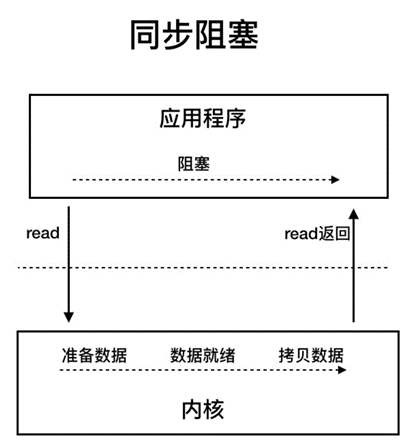
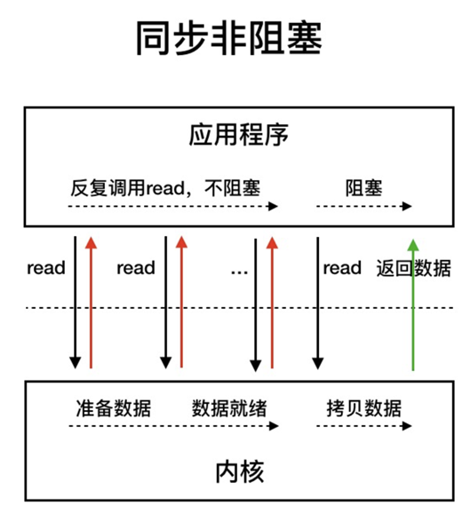
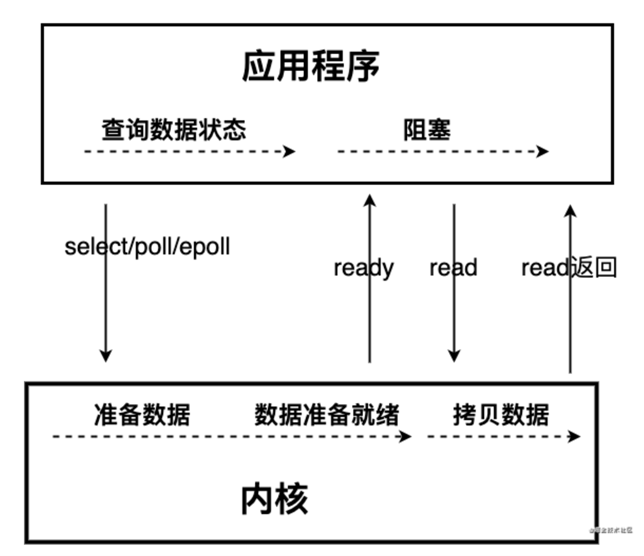

- [Java基础](#java基础)
  - [1.	Exception和Error的区别](#1exception和error的区别)
  - [2.	String能被继承吗？](#2string能被继承吗)
  - [3. Java有哪些基本数据类型](#3-java有哪些基本数据类型)
  - [4. 深拷贝和浅拷贝的区别？](#4-深拷贝和浅拷贝的区别)
  - [5. 什么是多态？多态有什么好处？](#5-什么是多态多态有什么好处)
  - [6. Arrays.sort()的原理？](#6-arrayssort的原理)
  - [7. 为什么重写equals()必须重写hashCode()？](#7-为什么重写equals必须重写hashcode)
  - [8.	StringBuilder和StringBuffer的区别？](#8stringbuilder和stringbuffer的区别)
  - [9.	BIO NIO AIO的区别](#9bio-nio-aio的区别)
  - [10. 代码块分别于什么时候执行？](#10-代码块分别于什么时候执行)
  - [11. static关键词的作用](#11-static关键词的作用)
  - [12. StackOverflow和OOM的区别与出现场景](#12-stackoverflow和oom的区别与出现场景)
  - [13. 什么情况下finally不执行？](#13-什么情况下finally不执行)

# Java基础

## 1.	Exception和Error的区别
两者的都是Throwable类的子类，按照Java源码当中注释的说明，两者的区别主要在于：<br>
+ Error表示的是一个合理的程序不应该尝试去捕捉的问题，大多都表示程序非正常运行的问题。这类问题很难单凭程序来处理，因此可能需要重新启动程序。
+ 而Exception则表示合理的程序可能会尝试去捕捉的问题。主要分为**受检查**(checked)的Exception和**不可检查**(unchecked)的Exception:
  - 大多数Exception都属于受检查的，受检查的Exception在代码中**必须**进行捕获(try…catch)处理。
  - RuntimeException和它的子类是不可检查的。不受检查的Exception**不强制**是否必须进行捕捉。

## 2.	String能被继承吗？
String是不能被继承的，这是因为String被设计成了final类型。

## 3. Java有哪些基本数据类型
Java共有8种基本数据类型：byte, char, short, int, long, float, double, boolean<br>
其位数与默认值如下表所示：<br>


|基本类型|位数(bit)|字节(byte)|默认值|
|----|----|----|----|
|int|32|4|0|
|short|16|2|0|
|long|64|8|0L|
|byte|8|1|0|
|char|16|2|'u0000'|
|float|32|4|0f|
|double|64|8|0d|
|boolean|1|-|false|

## 4. 深拷贝和浅拷贝的区别？
**深拷贝拷贝的是对象的内容，而浅拷贝拷贝的是对象的引用。**<br><br>
以数组为例，**Arrays.copyOf()**创建的就是数组的深拷贝，在进行深拷贝之后，对两个数组进行操作并不会相互影响；<br><br>
而如果直接对新对象赋值，则进行的是浅拷贝，这时操作其中一个数组，从另一个数组变量（其实存储的是引用）进行读取会发现内容也发现了改变。

## 5. 什么是多态？多态有什么好处？
多态指的是同一个接口根据不同的对象进行不同的操作，直接体现是父类的引用可以指向子类的对象，或者是接口的引用可以指向实现类的对象。<br>
多态的好处有：
+ 降低耦合度
+ 使得操作可以接口化，提高可扩展性

## 6. Arrays.sort()的原理？
1. 首先判断数组长度，如果排序的长度小于阈值，就使用双枢纽快排。
2. 之后评估乱序程度：用run数组记录每个单调子数组的开始下标，用count记录**单调子数组**的个数
   + 如果乱序程度较高，就使用双枢纽快排
   + 如果乱序程度低，则使用归并排序

对于双枢纽快排的详细实现，可以自行通过IDEA等IDE查看源代码，或上网查阅相关解析。这里不做详细介绍。

## 7. 为什么重写equals()必须重写hashCode()？
因为Java要求，相同的对象必须返回相同的hashCode()，而如果重写了equals()而不重写hashCode()，可能会导致相同的对象返回不同的哈希码，从而导致集合中出现相同的元素。<br><br>
以HashMap为例，HashMap是通过hashcode来计算键值对应该存储在数组的哪个位置，之后再判断是否已经存在这个key，而如果相同元素得到的hashcode不同，就可能导致定位到的数组位置不同，从而无法发现已经存在这个key。

## 8.	StringBuilder和StringBuffer的区别？
StringBuilder和StringBuffer都继承自AbstractStringBuilder类，其中的char[]没有被final修饰，也就是说，StringBuilder和StringBuffer的数据是**可变**的。<br><br>
两者的主要区别在于：
+ StringBuffer的绝大多数方法都被synchronized修饰，因此StringBuffer是线程安全的；
+ StringBuilder中的方法则没有被synchronized修饰，因此StringBuilder不是线程安全的。

## 9.	BIO NIO AIO的区别
**BIO**是同步阻塞I/O，在BIO模型下，应用程序read之后会一直阻塞，直到内核将数据拷贝到用户空间。这样的情况下，对于每个连接都需要一个线程，而线程的消耗是很高的。<br>
(下方图片源自网络，侵删)<br><br>

<br>

**NIO**有两个含义:
+ 一个是指同步非阻塞I/O（Non-Blocking I/O）
+ 另一个是指Java的NIO（New I/O），Java的NIO在同步非阻塞I/O模型的基础上还增加了多路复用的支持。

**NIO模型**（同步非阻塞I/O模型）是指反复调用read进行轮询，这个期间是不阻塞的，而直到内核将数据拷贝到用户空间之后，再用read读取数据，读取期间线程仍然是阻塞的。而单线程轮询的操作虽然节省了线程，但是对于资源的消耗也是较大的。<br><br>


<br>

在NIO模型的基础上，Java的NIO还增加了对**多路复用**的支持。在多路复用模型下，应用程序调用select()/epoll()，询问内核数据是否就绪，当数据就绪之后，才会返回值，这样减少了轮询带来的资源开销。


<br>

**AIO**则是异步的I/O，通过事件和回调机制来实现。当应用程序提交read()后会立即返回，而不会阻塞，读取完成后，系统会调用回调通知相应线程。

Java中BIO和NIO的区别在于:
+ BIO在等待数据就绪的过程中和读取的过程中都是阻塞的；NIO在等待数据就绪的过程中不阻塞、读取数据过程中阻塞；AIO在全程都不会阻塞。
+ 相比起BIO，NIO可以节约线程。因为NIO转为采用单线程轮询来等待数据就绪，而真正读取数据的过程速度是非常快的，可以达到1GB/s以上，可以理解为基本不耗时。
+ BIO是面向流的，NIO是面向缓冲区的。BIO只能每次从流中读取字节，直到全部读取，这些字节并没有被缓存；而NIO将数据先缓存到了缓冲区，之后再从缓冲区读取数据，可以在缓冲区中前后移动，读取的灵活性更高。
+ NIO使用了通道，而通道是双向的；BIO则使用流，流是单向的。

## 10. 代码块分别于什么时候执行？
+ 静态代码块在JVM加载类时执行。
+ 构造代码块（非静态代码块）在构造对象时执行，且执行时间早于构造方法。

## 11. static关键词的作用
+ 修饰变量或方法，表示这个变量/方法属于这个类，而不属于单个对象
+ 修饰代码块，表示该代码块为静态代码块
+ 修饰内部类，表示该类为静态内部类。可用于实现单例模式。

```java
public class StaticSingleton {
    /**
     * 只有当显式调用getInstance()方法之后，这里的静态内部类SingletonHolder才会被加载
     * 从而将INSTANCE初始化
     * 因此，通过静态内部类实现的单例模式是懒汉式的
     */
    private static class SingletonHolder {  // 通过静态内部类持有实例
        private static final StaticSingleton INSTANCE = new StaticSingleton();
    }

    private StaticSingleton() { }   // 用private隐藏构造方法

    public static StaticSingleton getInstance() {
        return SingletonHolder.INSTANCE;
    }
}
```
+ 可用于修饰import，进行静态导包，导入类中所有静态方法。最常见的使用场景是在JUnit进行单元测试时。

## 12. StackOverflow和OOM的区别与出现场景
StackOverflow和OutOfMemory的区别：
+ StackOverflow是指调用栈的深度超过-Xss设置的限制，一般是出现在不断进行递归的时候。
+ OOM则是JVM分配内存时发现内存不足产生的错误。

OOM的出现场景主要有以下几种：
+ **JVM堆溢出**。只需要不断地创建对象并保证对象有被引用，不会被回收，就会出现堆溢出。
+ **JVM堆的内存空间不足**
+ JVM没有足够的空间创建栈，或是JVM允许动态扩展栈，而扩展栈无法申请到足够的内存。
+ GC回收时间过长也会导致OOM。
+ 本地内存空间不足
+ 单个进程创建的线程数超过限制(Linux默认要求每个进程的线程数不超过1024)。
+ 方法区和运行时常量池溢出。

## 13. 什么情况下finally不执行？
+ try当中调用了System.exit()方法，直接终止了JVM的运行
+ 在守护线程中运行的finally，如果非守护线程终止，就不会执行
