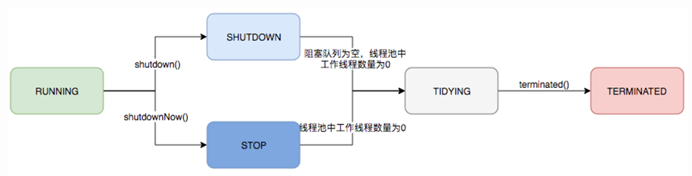

- [Java并发](#java并发)
  - [1.	Java内置的monitor锁的特征和实现方法](#1java内置的monitor锁的特征和实现方法)
  - [2.	Runnable和Callable接口的区别？](#2runnable和callable接口的区别)
  - [3.	submit()和execute()方法的区别？](#3submit和execute方法的区别)
  - [4. volatile修饰符的作用？](#4-volatile修饰符的作用)
  - [5. 并发编程的三个重要特性？](#5-并发编程的三个重要特性)
  - [6. sleep()和wait()方法的区别？](#6-sleep和wait方法的区别)
  - [7. 为什么新建线程后要调用start()方法而不调用run()方法？](#7-为什么新建线程后要调用start方法而不调用run方法)
  - [8. 说说synchronized的原理](#8-说说synchronized的原理)
  - [9. 说说synchronized的使用方法](#9-说说synchronized的使用方法)
  - [10. 谈谈乐观锁和悲观锁](#10-谈谈乐观锁和悲观锁)
  - [11. 谈谈ReentrantLock和synchronized的区别](#11-谈谈reentrantlock和synchronized的区别)
  - [12. 锁的优化机制](#12-锁的优化机制)
  - [13. 对象头中包含哪些内容？](#13-对象头中包含哪些内容)
  - [14. AQS的原理](#14-aqs的原理)
  - [15. 为什么需要线程池？](#15-为什么需要线程池)
  - [16. 如何设定线程池的大小](#16-如何设定线程池的大小)
  - [17. 线程池的原理](#17-线程池的原理)
  - [18. 应该如何构建线程池？](#18-应该如何构建线程池)
  - [19. sleep(0)的作用](#19-sleep0的作用)
  - [20. i++是原子的吗？可能发生什么情况？](#20-i是原子的吗可能发生什么情况)
  - [21. Java内存屏障](#21-java内存屏障)
  - [22. ThreadLocal是什么？](#22-threadlocal是什么)
  - [23. ReentrantLock的lock() tryLock() lockInterruptibly()的区别](#23-reentrantlock的lock-trylock-lockinterruptibly的区别)
  - [24. Java的线程模型是如何实现的](#24-java的线程模型是如何实现的)
  - [25. 谈谈分布式锁](#25-谈谈分布式锁)
  - [26. 对象锁和类锁是否会互相影响？](#26-对象锁和类锁是否会互相影响)
  - [27. Java锁可以降级吗？](#27-java锁可以降级吗)

# Java并发

## 1.	Java内置的monitor锁的特征和实现方法
Java内置的monitor锁主要有互斥和可重入两个特征。<br><br>
**互斥**就是指当一个线程持有锁的时候，其他的线程就不能再访问这块被锁住的内容。
<br><br>
**可重入**指的是当一个线程持有锁的时候，它可以重复地请求并获得这个锁。
<br><br>
对于互斥和可重入的实现，JVM对每个锁维护了一个计数器：每当有线程获取锁时，计数器的值就+1，而当锁被释放，计数器的值就-1，只有当计数器的值为0的时候，锁才能被任意进程获取。
<br><br>
此外，为了实现可重入，当一个计数器值为0的锁被获取时，JVM会记录下它所属的线程，使得这个线程可以再次获得这个锁。

## 2.	Runnable和Callable接口的区别？
+ Runnable接口无法返回值或抛出异常
+ Callable接口可以返回值，也可以抛出异常

两个接口定义如下：<br><br>
Runnable接口定义了没有返回值的run()方法
```java
@FunctionalInterface
public interface Runnable {
    void run();
}
```
Callable接口定义了有返回值的call()方法
```java
@FunctionalInterface
public interface Callable<V> {
    V call() throws Exception;
}
```

## 3.	submit()和execute()方法的区别？
+ execute()方法用于提交不需要返回值的任务，定义于Executor接口当中。
+ submit()方法用于提交需要返回值的任务，它返回Future对象，定义于ExecutorService接口当中。

```java
public interface Executor {
    void execute(Runnable var1);
}
```

```java
public interface ExecutorService extends Executor {
    ...
    <T> Future<T> submit(Callable<T> var1);
    <T> Future<T> submit(Runnable var1, T var2);
    Future<?> submit(Runnable var1);
    ...
}
```
通过上方代码可以看出，execute()没有返回值，且只能传入Runnable，而submit()会返回Future对象，且可以传入Callable或Runnable作为参数。

## 4. volatile修饰符的作用？
volatile修饰符的作用主要有以下两个：
+ **防止JVM的指令重排**。一般情况下，JVM会对代码的指令进行重排，而volatile修饰符可以防止JVM对这个变量的相关指令进行重排，确保了并发下的有序性。
+ **保证变量的可见性**。在JMM当中，每个线程都拥有一块自己的工作内存，线程可以把变量从主存读取到工作内存当中进行读写，在这种情况下，一个线程对内存做出了修改，可能另外一个线程无法看到，这样就无法保证可见性。而volatile修饰符可以标注变量，使得线程每次都会到主内存中对这个变量进行读写，从而保证了变量的可见性。

## 5. 并发编程的三个重要特性？
+ **原子性**：一个操作要么全部执行，要么都不执行。
+ **可见性**：当一个线程对共享的变量进行了修改，其他变量需要能够看到修改后的最新值。
+ **有序性**：确保代码执行顺序的正确。

## 6. sleep()和wait()方法的区别？
+ 两者最主要的区别是sleep()方法不会释放锁，而wait()方法释放了锁，并且需要在notify()之后重新竞争锁资源。
+ wait()方法只能在synchronized修饰的方法或代码块中被调用

## 7. 为什么新建线程后要调用start()方法而不调用run()方法？
因为当我们new了一个Thread之后，这个线程会处于新建状态，只有当我们调用了start()方法之后，线程才会进入就绪状态，从而被CPU分配时间片。
而如果我们不start()，而直接调用run()方法，实际上这个线程还处于新建状态，这时实际上是主线程在调用run()方法，而并没有利用到新建的线程。

## 8. 说说synchronized的原理
用synchronized修饰的作用是，确保被修饰的方法或代码块在同一时间只有一个线程对其进行访问。<br><br>
synchronized关键词本质上就是通过Java提供的monitor锁实现的，实现方法又分为显式调用和隐式调用两种：<br>
+ 修饰代码块即为**显式调用**，使用synchronized，编译之后，代码块的前后会分别加上*monitorenter*和*monitorexit*指令。*monitorenter*会尝试获取对象锁，如果计数器的值为0，或者线程是当前锁的拥有者，就会获取这个锁，并且使计数器+1；*monitorexit*则会释放锁，并且使计数器的值-1。
+ 修饰方法则是**隐式调用**。会将ACC_SYNCHRONIZED标记在运行时常量池当中，并被方法调用指令检测到。
通过synchronized加锁时，会清除工作内存当中的共享变量，从主内存中读取，释放时则将共享变量写回主内存。

## 9. 说说synchronized的使用方法
主要分为三种情况：修饰静态方法、修饰非静态方法（实例方法）、修饰代码块
+ 修饰静态方法时是给当前类加锁
+ 修饰实例方法时是给当前对象加锁
+ 修饰代码块时我们可以自行指定加锁对象
而synchronized最常见的使用场景就是实现单例模式。
实现代码如下：
```java
public class DoubleCheckSingleton {
    /**
     * 这里在定义对象的时候使用volatile，主要目的是为了防止指令重排。
     * JVM在定义对象时的四个关键步骤为：类加载检查、分配内存、初始化对象和将内存地址赋值给引用
     * 但是，第三步和第四步有可能发生指令重排。
     * 如果发生指令重排，在单例模式下就可能使得一个线程错误地使用了未被初始化的对象。
     */
    private volatile static DoubleCheckSingleton INSTANCE;  // volatile的主要目的是防止指令重排

    private DoubleCheckSingleton() { }      // 用private隐藏构造方法，防止构造出单例对象

    public static DoubleCheckSingleton getInstance() {
        if (INSTANCE == null) {     // 第一个if主要目的是控制加锁的条件
            synchronized (DoubleCheckSingleton.class) {
                if (INSTANCE == null) {     // 这里再次进行校验是为了防止多个线程同时进入if块，导致生成多个对象
                    INSTANCE = new DoubleCheckSingleton();
                }
            }
        }
        return INSTANCE;
    }
}
```

## 10. 谈谈乐观锁和悲观锁
Java中的synchronized关键字以及所有实现了Lock接口的类都是**悲观锁**，而Atomic类则是通过CAS实现的**乐观锁**。
<br><br>
**悲观锁**认为，自己在使用数据时一定会有其他线程来修改数据，因此在获取数据的时候会先加锁。而**乐观锁**则认为自己在使用数据的过程中不会有其他线程来修改数据，因此不添加锁，而是使用无锁算法，比如CAS自旋。
<br><br>
乐观锁的运用场景与悲观锁不同，一般来说：
+ 悲观锁用于写操作较多的场景，加锁可以确保数据的正确
+ 乐观锁则一般用于读操作多、写操作少的场景，无锁算法可以提高读的效率

**CAS算法**是最常用的无锁算法，它通过比较内存值V和寄存器中的值A，如果两个值相等，才用新的值B来更新内存中的值V。如果值不相等，它会循环自旋等待，直到两个值相等，而不会切换到其他线程。
<br><br>
CAS在**读多写少**的环境下很高效，但是也存在一些问题：
+ ABA问题。可能值原来是A，中间变成了B，但是检查时又被修改为A。
+ 如果循环等待时间长，开销就会较大。CAS操作是通过自旋避免线程切换，来减少线程切换的开销，但是如果操作长时间不成功，就会循环等待很久，这期间会一直占用CPU。
+ 只能保证一个变量操作的原子性。

## 11. 谈谈ReentrantLock和synchronized的区别
+ ReentrantLock**等待可中断**，而synchronized不行。也就是说，使用ReentrantLock时，如果锁长期没有被释放，线程可以放弃等待，而去处理其他任务，而使用synchronized时，线程就会一直等待，直到锁被释放。
+ ReentrantLock可以在构造函数中设定**支持公平锁**，而synchronized不可以。
+ ReentrantLock可以绑定多个Condition对象，从而实现绑定多个条件，而synchronized只能绑定一个条件。

公平锁和非公平锁：
+ **公平锁**是指多个线程按照申请锁的顺序获得锁，当线程申请锁时直接进入等待队列.
+ **非公平锁**则不保证按照申请锁的顺序来获得锁，线程申请锁时会先尝试直接获取锁，无法获取时再进入等待队列，这样有时可以节省唤醒线程的开销。

## 12. 锁的优化机制
Java采取了许多机制来对synchronized锁进行优化，包括自旋锁、自适应自旋锁、锁消除、锁粗化、锁的升级（偏向锁和轻量级锁）。
+ **自旋锁**是指当等待的资源被锁定时不切换进程，而是选择自旋等待。这是因为大部分时候锁被占用的时间都很短，进行从用户态到内核态的切换造成的开销可能比自旋等待要大很多，因此，自旋锁不进行线程切换，而是继续运行，等待锁的释放。
+ **自适应自旋锁**就是在自旋锁的基础上，使得自旋的时长不再是固定的，而是根据前一次在这个锁上的自旋时间以及锁的持有者来进行判定。
+ **锁消除**指的是如果JVM检测到一些synchronized修饰过的代码块实际上不存在资源竞争，就会不再进行加锁。
+ **锁粗化**指的是如果JVM检测到一系列对同一个对象进行加锁的操作，会把同步的范围扩大到整段代码，从而减少加锁和释放锁带来的开销。
+ **锁的升级**主要表示**无锁**→**偏向锁**→**轻量级锁**→**重量级锁**的状态。
    - **无锁**表示资源能被所有线程访问，但只有一个线程能够修改成功，其他线程会不断重试。
    - **偏向锁**是指当一段同步的代码一直被一个线程访问，这个线程会自动获得锁，从而降低获取锁的开销。这是因为大多数情况下，锁都是由一个线程获得，不存在多线程竞争。
    - 当偏向锁被其他线程访问，就会升级成**轻量级锁**。轻量级锁是指其他线程会以**自旋**的方式尝试获取锁，而不会阻塞，从而减少线程切换的开销。
    - 当自旋超过一定的次数，或者是已经有线程在自旋的情况下出现第三个访问的线程，锁就会升级为**重量级锁**。重量级锁是指其他线程会**阻塞**并等待锁得到释放，而不再以自旋的方式等待获得锁。

## 13. 对象头中包含哪些内容？
在说对象头之前，首先需要明确对象的内存分布。对象包括三个部分：
+ **对象头**
+ 实例数据
+ 对齐填充

而**对象头**本身则主要包括两部分内容：
+ Mark Word：当中包含了对象的hashcode、分代年龄、轻量级锁指针、重量级锁指针、GC标记、偏向锁线程ID、偏向锁时间戳。
+ Klass Point：指向类元数据的指针，用于确定对象是哪个类的对象。

## 14. AQS的原理
我们常提到的ReentrantLock, Semaphore等都是基于AQS（Abstract Queued Synchronized）。<br><br>
AQS的原理主要是内部维护一个用volatile修饰（为了确保线程可见性）的state状态位，尝试加锁的时候会通过CAS操作将其设为1，并且把当前线程ID赋值；而释放锁时会把state重新设为0，同时把当前线程ID置为空。<br><br>
同时，AQS还通过CLH队列来实现锁的分配，将请求锁的线程封装成队列的节点。

## 15. 为什么需要线程池？
+ 线程的创建和销毁都需要较大的开销，使用线程池可以降低这部分的资源消耗。
+ 不用等待线程创建，可以提高响应速度。
+ 使用线程池可以提高线程的可管理性。没有线程池的情况下，资源可能被无限制的申请，很可能导致系统资源耗尽。

## 16. 如何设定线程池的大小
设定线程池的大小主要有以下几种方案。<br><br>
（1）首先是《Java并发编程实战》当中给出的公式：<br><br>
$N_{thread}=N_{CPU}\times U_{CPU}\times (1+\frac{W}{C})$
<br><br>
其中，$N_{cpu}$表示CPU数量，$U_{cpu}$表示期望的CPU利用率，$\frac{W}{C}$表示等待时间和计算时间的比值。
<br><br>
根据上述公式，对于计算密集型的任务，我们近似认为W/C=0，因此，线程数就等于CPU核心数。但是，为了保证某个线程出现错误而阻塞时，CPU仍然能够得到充分利用，我们将计算密集型的任务线程池大小设为N+1。<br><br>
当然，上述公式也存在很明显的问题，就是它太理论化了，在实际的业务场景当中，我们实际上很难了解W/C的值。<br><br>
（2）此外是一些经验值：
比如，对于I/O密集型应用，有:<br><br>
$coreSize = 2 \times N$ <br>
$maxSize = 25 \times N$ <br><br>
当然，使用这种固定的经验值也同样存在问题。首先，这种经验值没有考虑到使用多个线程池的情况；此外，这种固定的值也同样无法适应复杂的业务场景。<br><br>
（3）此外，还有一种线程池参数动态化的方法：<br><br>
在美团技术团队的博客[Java线程池实现原理及其在美团业务中的实践](https://tech.meituan.com/2020/04/02/java-pooling-pratice-in-meituan.html)里介绍了一种动态化线程池，通过ThreadPoolExecutor提供的set方法，修改corePoolSize的大小。

## 17. 线程池的原理
(1) **线程池的生命周期**<br><br>
线程池内部用一个变量维护了两个值，将线程池的状态以及工作线程数维护到了同一个AtomicInteger变量ctl当中，ctl的高3位用于存储状态，低29位用于存储工作线程数。<br><br>

<br><br>
线程池状态的转换如上图所示:
<br>
在**RUNNING**状态下:
+ 如果运行shutdown()方法，就会进入**SHUTDOWN**状态，这时线程池不再接受新提交的任务，但还会处理阻塞队列中的任务；
+ 而如果运行shutdownNow()方法，线程池会进入**STOP**状态，此时线程池不仅不再接受新的任务，同时也不会执行阻塞队列中的任务，并且放弃当前正在执行的任务。

当阻塞队列为空且工作线程数为0时，就进入**TIDYING**状态，之后执行terminated()方法，执行完成后就进入**TERMINATED**状态。
<br><br>

(2) **任务执行** <br><br>
当我们用execute()提交一个任务之后，会进行以下的判断：
+ 首先检测线程池状态，如果不是RUNNING，直接拒绝。
+ 之后，如果当前工作线程数小于coreSize，新建并启动线程，直接执行。（注意，线程池在创建时并不会直接新建coreSize个线程，而是随着任务到来逐渐新建）
+ 如果工作线程数大于等于coreSize，且阻塞队列未满，将任务加入到阻塞队列当中。
+ 如果工作线程数大于等于coreSize，且阻塞队列已满，则创建并启动新的线程来执行新提交的任务。
+ 如果工作线程数已达到maxSize，且阻塞队列已满，则拒绝该任务。
对于任务的拒绝，有以下的饱和拒绝策略：
+ **AbortPolicy**：丢弃任务，并抛出RejectedExecutionException异常。
+ **DiscardPolicy**：丢弃任务，且不抛出异常。
+ **CallerRunsPolicy**：直接由提交任务的线程来执行此任务。
+ **DiscardOldestPolicy**: 丢弃阻塞队列最前面的任务，然后重新提交本任务。

<br>

(3) **Worker线程** <br><br>

线程池用Worker类封整了线程，此外，还封装了一个Runnable的引用，使得创建Worker线程时可以直接给它赋予任务。当第一个任务执行结束，或是在创建时没有被赋予任务，worker需要通过getTask()来获取任务并执行。<br><br>
当worker无法获取任务之后，会主动回收自己，这里的回收是依赖JVM的GC机制，当worker无法获取任务，它就会主动清除自己在线程池当中的引用。

## 18. 应该如何构建线程池？
最好的方法是使用ThreadPoolExecutor类的构造方法来进行新建，这样我们可以对corePoolSize、maxPoolSize、阻塞队列、存活时间、饱和策略等重要参数进行自定义。（关于线程池大小的设置可见[16.如何设定线程池的大小](#16-如何设定线程池的大小)）<br><br>

另一种方法是使用Executors中的方法进行构造，但是Executors中实现的线程池都存在一些缺陷。
+ 比如FixedThreadPool和SingleThreadExecutor在构造时使用了默认的，长度为Integer.MAX_VALUE的LinkedBlockingQueue作为阻塞队列，这样可能会导致任务堆积过多。
+ 而CachedThreadPool和ScheduledThreadPool则将maxPoolSize设为了Integer.MAX_VALUE，这可能导致创建的线程过多。

上述两种情况，最终都可能导致OOM。

## 19. sleep(0)的作用
使得操作系统重新进行一次CPU时间的竞争，在这之后可能仍然是这个线程获得CPU时间，也可能是其他线程获得CPU时间。

## 20. i++是原子的吗？可能发生什么情况？
i++不是原子的，因为i++实际上有三个步骤：从内存读取到寄存器、寄存器自增、从寄存器写回内存，这三个过程是可以分开的，而不是原子的。<br><br>

可能出现两个线程分别调用i++，之后i分别被两次读入寄存器并自增，重新写入之后结果为i+1，而非期望的i+2。

## 21. Java内存屏障
Java的内存屏障主要有四种：
+ Load Load，保证Load 2的读取操作一定不会重排到Load 1之前
+ Load Store，保证读操作在写操作之前
+ Store Load，保证写操作在可见之后才执行读操作
+ Store Store，保证别的CPU一定先看到Store 1的数据，再看到Store 2的数据

<br>
JVM对于内存屏障最主要的运用就是实现volatile关键字：<br><br>

我们知道，volatile的作用之一是**禁止指令重排**，这里的禁止指令重排其实是禁止写操作向前排、读操作向后排。而volatile实现防止指令重排的方式就是插入内存屏障，JVM的实现会在volatile读写前后均加上内存屏障，在一定程度上保证有序性。

## 22. ThreadLocal是什么？
ThreadLocal的作用是使线程拥有对象的副本，使其线程封闭，即仅在单线程内访问数据。<br><br>

ThreadLocal的原理是通过操作Thread当中的ThreadLocalMap。ThreadLocalMap的底层数据结构是Entry[]，Entry继承自ThreadLocal的弱引用，并额外存储了一个Object引用（即value）。我们可以将这个ThreadLocal的弱引用看作key，而value，即Entry中存储的Object是强引用。这里将key设为弱引用的原因是，如果使用正常Key-Value的形式，那么只要线程仍然存活，那么Entry就一直会处于可达的状态，从而不会被回收。<br><br>

如果外部不存在对ThreadLocal的强引用，那么ThreadLocal对象在下一次GC就会被回收。这时key被设为null，但value仍存在强引用，需要等待下一次调用set() get() remove()时进行回收。<br><br>

对于哈希冲突，ThreadLocalMap和HashMap的处理方法不一致，HashMap采用的是链地址法，而ThreadLocalMap则是通过线性向后查找来处理哈希冲突的。<br><br>

因此，在get()的时候，如果计算出的下标非空但key值不符合，就需要向后遍历查找，直到遇到空的位置为止。<br><br>

相关源代码如下：<br>
ThreadLocal变量存储在Thread对象中的ThreadLocalMap当中
```java
public class Thread implements Runnable {
    ...
    // 用于存储ThreadLocal
    ThreadLocalMap threadLocals;
    // 用于存储可集成的ThreadLocal
    ThreadLocalMap inheritableThreadLocals;
    ...
}

public class ThreadLocal<T> {
    static class ThreadLocalMap {
        ...
        // Entry继承自弱引用，value存储的值为对象
        // 这样，当外部引用消失时，ThreadLocal对象就会在下一次GC时被回收
        // 如果使用强引用，ThreadLocal对象就会一直被强引用，从而无法回收
        static class Entry extends WeakReference<ThreadLocal<?>> {
            Object value;

            Entry(ThreadLocal<?> k, Object v) {
                super(k);
                this.value = v;
            }
        }
        ...
        private void set(ThreadLocal<?> key, Object value) {
            ThreadLocal.ThreadLocalMap.Entry[] tab = this.table;
            int len = tab.length;
            int i = key.threadLocalHashCode & len - 1;

            // 当出现哈希冲突（即e != null时），向后线性查找
            for(ThreadLocal.ThreadLocalMap.Entry e = tab[i]; e != null; e = tab[i = nextIndex(i, len)]) {
                ThreadLocal<?> k = (ThreadLocal)e.get();
                if (k == key) {
                    e.value = value;
                    return;
                }

                if (k == null) {
                    this.replaceStaleEntry(key, value, i);
                    return;
                }
            }

            tab[i] = new ThreadLocal.ThreadLocalMap.Entry(key, value);
            int sz = ++this.size;
            if (!this.cleanSomeSlots(i, sz) && sz >= this.threshold) {
                this.rehash();
            }
        }
    }
}
```

## 23. ReentrantLock的lock() tryLock() lockInterruptibly()的区别
+ lock()方法会尝试获取锁，如果锁被其他线程池有，当前线程会一直阻塞直到拿到锁。
+ tryLock()方法也会尝试获取锁，但是当获取不到锁且等待时间超过限制之后，会直接返回false，而不会一直等待。
+ lockInterruptibly()也会尝试获取锁，阻塞时可以被interrupt()唤醒并处理InterruptedException。

## 24. Java的线程模型是如何实现的
在JDK1.2之后，Java的线程模型就通过一对一映射的方式来实现，也就是说，一个用户线程（轻量级进程）映射一个内核线程，各种线程操作（如创建、析构、同步等）都需要进行系统调用，因此需要用户态到内核态的切换。

## 25. 谈谈分布式锁
Java当中的锁只能在单机的环境下保证操作的同步，但是在分布式集群下就没有办法了，因此我们需要引入分布式锁，用于控制分布式系统之间同步访问共享资源。<br><br>

常见的实现主要是通过Redis实现分布式锁，利用Redis的**SETNX**命令，只有当key不存在时，才可以SET成功，当key存在时，我们就认为这个资源上锁了。此外，为了避免持有锁的单机宕机导致锁一直不被释放，我们需要为这个key设置一个超时时间，但是这里需要注意，如果我们使用SETNX和EXPIRE命令，这两个命令并不是原子的，也就是可能出现前者执行而后者未执行的情况，因此我们需要使用SET指令的参数，设置**NX**和**EX**，来确保这两个操作是原子完成的。<br><br>

上述的情况是通过Redis单机来实现分布式锁，这样也存在一个问题，就是Redis单机挂掉会导致整体服务无法正常运行，因此我们还需要考虑通过**Redis集群**来实现。Redis分布式环境下，一般使用Redis的作者提出的**RedLock算法**实现分布式锁。在这种算法下，只有当客户端从集群中过半的Redis节点获取到锁，才算成功获取。而如果获取锁失败或是超时，客户端需要释放所有的已经获取到的锁（通过lua脚本实现）。<br><br>

## 26. 对象锁和类锁是否会互相影响？
当一个线程获取某个类的锁访问静态资源时，另一个线程仍可以获得这个类的对象锁。

## 27. Java锁可以降级吗？
JDK本身没有对Java锁是否可以降级有过明确规定，HotSpot也曾经提出过锁降级的草案，但是最后似乎没有正式使用。主要问题还是在于对锁进行升降级的操作本身开销较大。
